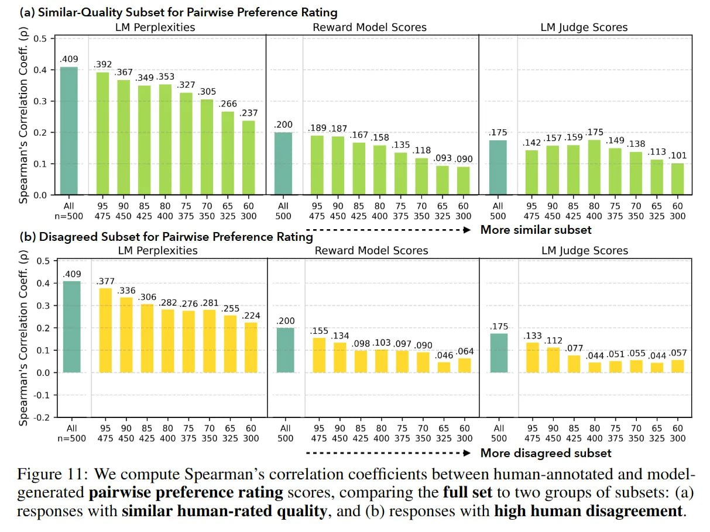

# Image Description

**File:** img_1764342532_aqadjhjrgr9qul_figure_11_we_compute_spearman_s_correlat.jpg
**Original:** image.jpg
**Received:** 1764342532

## Extracted Text (OCR)

Figure 11: We compute Spearman's correlation coefficients between human-annotated and modelgenerated pairwise preference rating scores, comparing the full set to two groups of subsets: (a) responses with sumilar human-rated quality, and (b) responses with high human disagreement.

<!-- image -->

## Usage Instructions

When referencing this image in markdown:
1. Use relative path based on file location
2. Add descriptive alt text based on OCR content above
3. Add text description BELOW the image for GitHub rendering

Example:
```markdown
 <!-- TODO: Broken image path -->

**Image shows:** [Describe what the image contains based on OCR]
```
