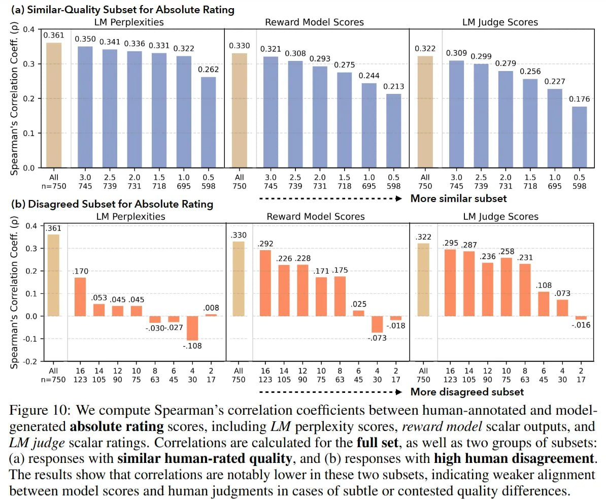

# Image Description

**File:** img_1764342532_aqadjrjrgr9qul_figure_10_we_compute_spearman_s_correlat.jpg
**Original:** image.jpg
**Received:** 1764342532

## Extracted Text (OCR)

Figure 10: We compute Spearman's correlation coefficients between human-annotated and modelgenerated absolute rating scores, including LM perplexity scores, reward model scalar outputs, and LM judge scalar ratings. Correlations are calculated for the full set, as well as two groups of subsets: (a) responses with similar human-rated quality, and (b) responses with high human disagreement. The results show that correlations are notably lower in these two subsets, indicating weaker alignment between model scores and human judgments in cases of subtle or contested quality differences.

<!-- image -->

## Usage Instructions

When referencing this image in markdown:
1. Use relative path based on file location
2. Add descriptive alt text based on OCR content above
3. Add text description BELOW the image for GitHub rendering

Example:
```markdown
 <!-- TODO: Broken image path -->

**Image shows:** [Describe what the image contains based on OCR]
```
