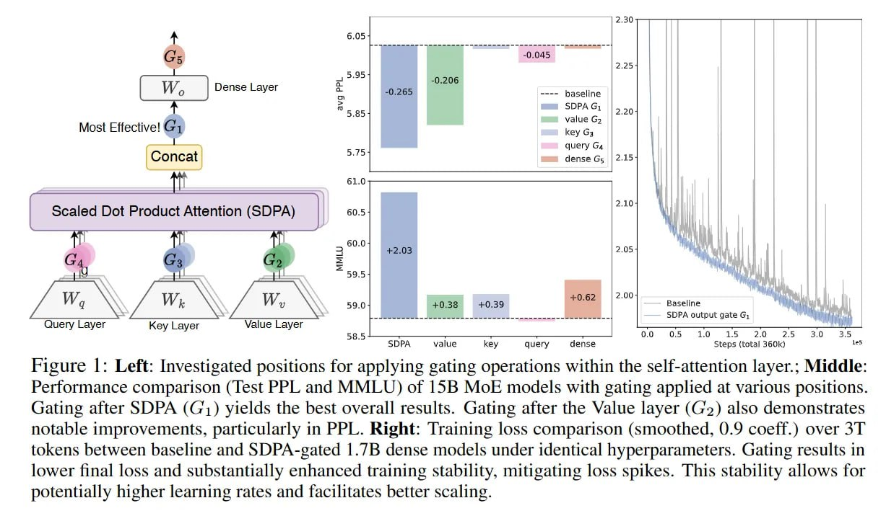

# Image Description

**File:** img_1764342547_aqadza1rgr9sul_figure_left_investigated_positions_for.jpg
**Original:** image.jpg
**Received:** 1764342547

## Extracted Text (OCR)

Figure |: Left: Investigated positions for applying gating operations within the self-attention layer.; Middle: Performance comparison (Test PPL and MMLU) of 15B MoE models with gating applied at various positions. Gating after SDPA (С!) yields the best overall results. Gating after the Value layer (G2) also demonstrates notable improvements, particularly in PPL. Right: Training loss comparison (smoothed, 0.9 coeff.) over 3T tokens between baseline and SDPA-gated 1.7В dense models under identical hyperparameters. Gating results in lower final loss and substantially enhanced training stability, mitigating loss spikes. This stability allows for potentially higher learning rates and facilitates better scaling.

<!-- image -->

## Usage Instructions

When referencing this image in markdown:
1. Use relative path based on file location
2. Add descriptive alt text based on OCR content above
3. Add text description BELOW the image for GitHub rendering

Example:
```markdown
 <!-- TODO: Broken image path -->

**Image shows:** [Describe what the image contains based on OCR]
```
