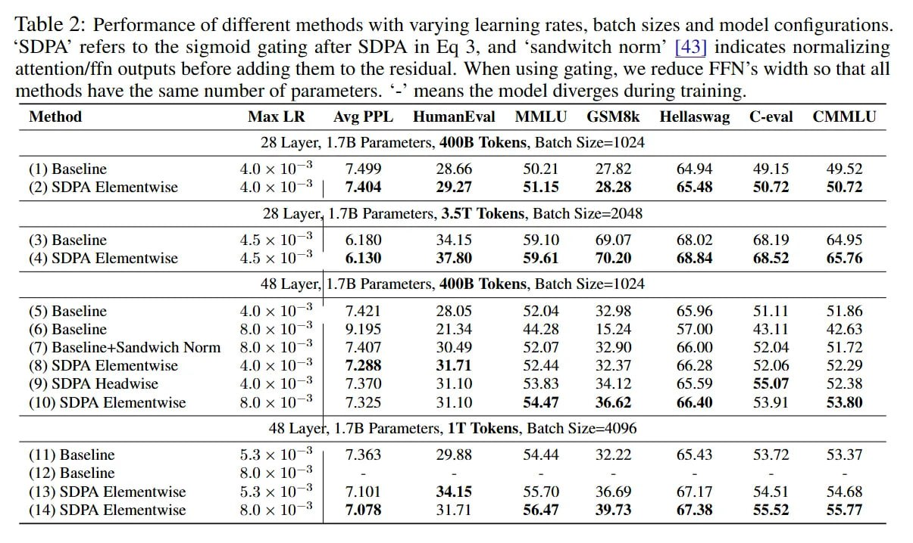

# Image Description

**File:** img_1764342547_aqadzg1rgr9sul_table_2_performance_of_different_methods.jpg
**Original:** image.jpg
**Received:** 1764342547

## Extracted Text (OCR)

Table 2: Performance of different methods with varying learning rates, batch sizes and model configurations. 'SDPA' refers to the sigmoid gating after SDPA in Eq 3, and 'sandwitch norm' [43| indicates normalizing ацепноп/ Лт outputs before adding them to the residual. When using gating, we reduce FFN's width so that all &amp;

methods have the same number of parameters. '- means the model! diverges during training.

|                                                                                                                                                                                                                                                                                                                                                                                                                                                  | Method Max LKR Ave PPL HumankKval MMLU GSM8k = Hellaswag C-eval CMMLU   |                                                          |                                                          |                                                          |                                                          |                                                          |                                                          |                                                          |
|--------------------------------------------------------------------------------------------------------------------------------------------------------------------------------------------------------------------------------------------------------------------------------------------------------------------------------------------------------------------------------------------------------------------------------------------------|-------------------------------------------------------------------------|----------------------------------------------------------|----------------------------------------------------------|----------------------------------------------------------|----------------------------------------------------------|----------------------------------------------------------|----------------------------------------------------------|----------------------------------------------------------|
| 28 Layer, 1.7В Parameters, 4008 Tokens, Batch Size=1024                                                                                                                                                                                                                                                                                                                                                                                          | 28 Layer, 1.7В Parameters, 4008 Tokens, Batch Size=1024                 | 28 Layer, 1.7В Parameters, 4008 Tokens, Batch Size=1024  | 28 Layer, 1.7В Parameters, 4008 Tokens, Batch Size=1024  | 28 Layer, 1.7В Parameters, 4008 Tokens, Batch Size=1024  | 28 Layer, 1.7В Parameters, 4008 Tokens, Batch Size=1024  | 28 Layer, 1.7В Parameters, 4008 Tokens, Batch Size=1024  | 28 Layer, 1.7В Parameters, 4008 Tokens, Batch Size=1024  | 28 Layer, 1.7В Parameters, 4008 Tokens, Batch Size=1024  |
| (1) Baseline 4.0 х 10? 7.499 28.66 50.21 27.82 64.94 49.15 49.52 (2) SDPA Elementwise 4.0 x 10? | 7.404 29.27 51.15 28.28 65.48 50.72 50.72                                                                                                                                                                                                                                                                                                      |                                                                         |                                                          |                                                          |                                                          |                                                          |                                                          |                                                          |                                                          |
| 28 Layer, 1.7B Parameters, 3.5T ‘Tokens, Batch Size=2048                                                                                                                                                                                                                                                                                                                                                                                         | 28 Layer, 1.7B Parameters, 3.5T ‘Tokens, Batch Size=2048                | 28 Layer, 1.7B Parameters, 3.5T ‘Tokens, Batch Size=2048 | 28 Layer, 1.7B Parameters, 3.5T ‘Tokens, Batch Size=2048 | 28 Layer, 1.7B Parameters, 3.5T ‘Tokens, Batch Size=2048 | 28 Layer, 1.7B Parameters, 3.5T ‘Tokens, Batch Size=2048 | 28 Layer, 1.7B Parameters, 3.5T ‘Tokens, Batch Size=2048 | 28 Layer, 1.7B Parameters, 3.5T ‘Tokens, Batch Size=2048 | 28 Layer, 1.7B Parameters, 3.5T ‘Tokens, Batch Size=2048 |
| (3) Baseline 45x10-° | 6.180 34.15 59.10 69.07 68.02 68.19 64.95 (4) SDPA Elementwise 45x10-° 6.130 37.80 59.61 70.20 68.84 68.52 65.76                                                                                                                                                                                                                                                                                                          |                                                                         |                                                          |                                                          |                                                          |                                                          |                                                          |                                                          |                                                          |
| 48 Layer,|1.7B Parameters, 400B Tokens, Batch Size=1024                                                                                                                                                                                                                                                                                                                                                                                          | 48 Layer,|1.7B Parameters, 400B Tokens, Batch Size=1024                 | 48 Layer,|1.7B Parameters, 400B Tokens, Batch Size=1024  | 48 Layer,|1.7B Parameters, 400B Tokens, Batch Size=1024  | 48 Layer,|1.7B Parameters, 400B Tokens, Batch Size=1024  | 48 Layer,|1.7B Parameters, 400B Tokens, Batch Size=1024  | 48 Layer,|1.7B Parameters, 400B Tokens, Batch Size=1024  | 48 Layer,|1.7B Parameters, 400B Tokens, Batch Size=1024  | 48 Layer,|1.7B Parameters, 400B Tokens, Batch Size=1024  |
| (5) Baseline 4.0 x 107° 7.421 28.05 52.04 32.98 65.96 51.11 51.86 (6) Baseline 8.0x10-° | 9.195 21.34 44 28 15.24 57.00 43.1 42.63 (7) Baseline+Sandwich Norm 8.0 х 10° | 7.407 30.49 52.07 32.90 66.00 52.04 51.72 (8) SDPA Elementwise 40 х10-° | 7.288 31.71 52.44 32.37 66.28 52.06 52.209 (9) SDPA Headwise 40x10-° | 7.370 31.10 53.83 34.12 65.59 55.07 52.38 (10) SDPA Elementwise 8.0x107-° | 7.325 31.10 54.47 36.62 66.40 53.91 53.80 |                                                                         |                                                          |                                                          |                                                          |                                                          |                                                          |                                                          |                                                          |
| 48 Layer, 1.7В Parameters, ТТ Tokens, Batch Size=4096                                                                                                                                                                                                                                                                                                                                                                                            | 48 Layer, 1.7В Parameters, ТТ Tokens, Batch Size=4096                   | 48 Layer, 1.7В Parameters, ТТ Tokens, Batch Size=4096    | 48 Layer, 1.7В Parameters, ТТ Tokens, Batch Size=4096    | 48 Layer, 1.7В Parameters, ТТ Tokens, Batch Size=4096    | 48 Layer, 1.7В Parameters, ТТ Tokens, Batch Size=4096    | 48 Layer, 1.7В Parameters, ТТ Tokens, Batch Size=4096    | 48 Layer, 1.7В Parameters, ТТ Tokens, Batch Size=4096    | 48 Layer, 1.7В Parameters, ТТ Tokens, Batch Size=4096    |
| (11) Baseline 5.3x10-° | 7.363 29.88 54.44 32.22 65.43 53.72 53.37 (12) Baseline 8.0 10-° |                                                                                                                                                                                                                                                                                                                                                      |                                                                         |                                                          |                                                          |                                                          |                                                          |                                                          |                                                          |                                                          |
| (13) SDPA Elementwise 5.3x10-° | 7.101 34.15 55.70 36.69 67.17 54.51 54.68                                                                                                                                                                                                                                                                                                                                                                       |                                                                         |                                                          |                                                          |                                                          |                                                          |                                                          |                                                          |                                                          |
| (14) SDPA Elementwise 8.0x10-° | 7.078 31.71 56.47 39.73 67.38 55.52 55.77                                                                                                                                                                                                                                                                                                                                                                       |                                                                         |                                                          |                                                          |                                                          |                                                          |                                                          |                                                          |                                                          |

## Usage Instructions

When referencing this image in markdown:
1. Use relative path based on file location
2. Add descriptive alt text based on OCR content above
3. Add text description BELOW the image for GitHub rendering

Example:
```markdown
 <!-- TODO: Broken image path -->

**Image shows:** [Describe what the image contains based on OCR]
```
