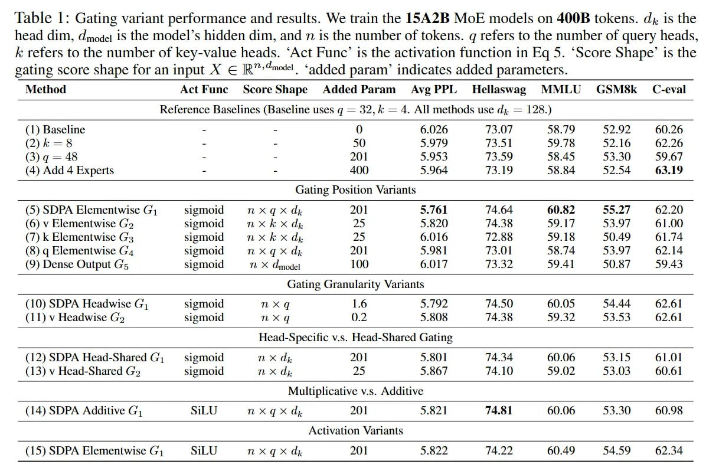

# Image Description

**File:** img_1764342547_aqadzq1rgr9sul_table_1_gating_variant_performance_and.jpg
**Original:** image.jpg
**Received:** 1764342547

## Extracted Text (OCR)

Table 1: Gating variant performance and results. We train the 15A2B MoE models on 400B tokens. dz is the head dim, dmode 1$ the model's hidden dim, and 7m 1$ the number of tokens. д refers to the number of query heads, к refers to the number of key-value heads. 'Act Func' is the activation function in Eq 5. "Score Shape' 1$ the eating score shape for an input X € ®"' това. 'added param' indicates added parameters.

|                                                                                                                                                                                                                                                                                                                                                                       | Viethod Act Func sScoreShape Added Param Ave PPL Hellaswag MIMLU GSM6&k £C-eval            |                                                                                             |                                                                             |                                                                             |                                                                             |                                                                             |                                                                             |                                                                             |
|-----------------------------------------------------------------------------------------------------------------------------------------------------------------------------------------------------------------------------------------------------------------------------------------------------------------------------------------------------------------------|--------------------------------------------------------------------------------------------|---------------------------------------------------------------------------------------------|-----------------------------------------------------------------------------|-----------------------------------------------------------------------------|-----------------------------------------------------------------------------|-----------------------------------------------------------------------------|-----------------------------------------------------------------------------|-----------------------------------------------------------------------------|
| Reference Baselines (Baseline uses а = 32,4 = 4. All methods use d; = 128.)                                                                                                                                                                                                                                                                                           | Reference Baselines (Baseline uses а = 32,4 = 4. All methods use d; = 128.)                | Reference Baselines (Baseline uses а = 32,4 = 4. All methods use d; = 128.)                 | Reference Baselines (Baseline uses а = 32,4 = 4. All methods use d; = 128.) | Reference Baselines (Baseline uses а = 32,4 = 4. All methods use d; = 128.) | Reference Baselines (Baseline uses а = 32,4 = 4. All methods use d; = 128.) | Reference Baselines (Baseline uses а = 32,4 = 4. All methods use d; = 128.) | Reference Baselines (Baseline uses а = 32,4 = 4. All methods use d; = 128.) | Reference Baselines (Baseline uses а = 32,4 = 4. All methods use d; = 128.) |
| 1) Baseline - - 0 6.026 #847 55.19 32.92 60.26                                                                                                                                                                                                                                                                                                                        |                                                                                            | (2) 2 - - 50 5.979 73.51 59.78 52.16 62.26 3) а = 46 - - 201 5.953 {5.59 55.453 55.30 59.67 |                                                                             |                                                                             |                                                                             |                                                                             |                                                                             |                                                                             |
| Gating Position Variants                                                                                                                                                                                                                                                                                                                                              | Gating Position Variants                                                                   | Gating Position Variants                                                                    | Gating Position Variants                                                    | Gating Position Variants                                                    | Gating Position Variants                                                    | Gating Position Variants                                                    | Gating Position Variants                                                    | Gating Position Variants                                                    |
| (5) SDPA Elementwise Gy sigmoid mx @qxX dz 201 5.761 74.64 60.82 55.27 62.20 (6) v Elementwise Go sigmoid хх dz 25 5.820 74.38 59.17 53.97 61.00 (7) k Elementwise G3 sigmoid mxk x dp 25 5.016 72.88 59.18 50.49 61.74 (8) q Elementwise G4 sigmoid nmxqx dz 201 5.981 73.01 58.74 53.97 62.14 (9) Dense Output Gs sigmoid Ti това 100 6.017 73.32 59.4] 50.87 59.43 |                                                                                            |                                                                                             |                                                                             |                                                                             |                                                                             |                                                                             |                                                                             |                                                                             |
| Gating Granularity Variants                                                                                                                                                                                                                                                                                                                                           | Gating Granularity Variants                                                                | Gating Granularity Variants                                                                 | Gating Granularity Variants                                                 | Gating Granularity Variants                                                 | Gating Granularity Variants                                                 | Gating Granularity Variants                                                 | Gating Granularity Variants                                                 | Gating Granularity Variants                                                 |
| (10) SDPA Headwise G, sigmoid ха 1.6 5.7192 74.50 60.05 54.44 62.6] (11) у Headwise Go» sigmoid nx q 0.2 5.808 14.38 59.32 53.53 62.6]                                                                                                                                                                                                                                |                                                                                            |                                                                                             |                                                                             |                                                                             |                                                                             |                                                                             |                                                                             |                                                                             |
| (12) SDPA Head-Shared G, sigmoid m& ЦЕ 201 5.801 14.34 60.06 53.15 61.01 (13) v Head-Shared Go sigmoid mh Х dp 25 5.867 74.10 59.02 53.03 60.61                                                                                                                                                                                                                       |                                                                                            |                                                                                             |                                                                             |                                                                             |                                                                             |                                                                             |                                                                             |                                                                             |
| Head-Specific v.s. Head-Shared Gating                                                                                                                                                                                                                                                                                                                                 | Head-Specific v.s. Head-Shared Gating                                                      | Head-Specific v.s. Head-Shared Gating                                                       | Head-Specific v.s. Head-Shared Gating                                       | Head-Specific v.s. Head-Shared Gating                                       | Head-Specific v.s. Head-Shared Gating                                       | Head-Specific v.s. Head-Shared Gating                                       | Head-Specific v.s. Head-Shared Gating                                       | Head-Specific v.s. Head-Shared Gating                                       |
| (14) SDPA Additive G, SiLU mx qx dh 201 5.821 74.81 60.06 53.30 60.98                                                                                                                                                                                                                                                                                                 | Activation Vanants (15) SDPA Elementwise G, SiLU m xXx Ш 201 5.822 74.22 60.49 54.59 62.34 |                                                                                             |                                                                             |                                                                             |                                                                             |                                                                             |                                                                             |                                                                             |

## Usage Instructions

When referencing this image in markdown:
1. Use relative path based on file location
2. Add descriptive alt text based on OCR content above
3. Add text description BELOW the image for GitHub rendering

Example:
```markdown
 <!-- TODO: Broken image path -->

**Image shows:** [Describe what the image contains based on OCR]
```
