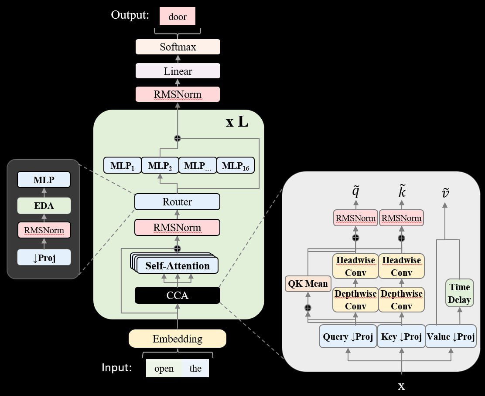

# Image Description

**File:** img_1764342923_aqadrqtrgxk9oul_self_attention.jpg
**Original:** image.jpg
**Received:** 1764342923

## Extracted Text (OCR)

( Self-Attention | и | | | | Headwise Headwise

| Conv | Conv

Delay

Embedding 8 ee Query | Pro] | Key | Proj | Value | Pro]

Time

Te \_.

## Usage Instructions

When referencing this image in markdown:
1. Use relative path based on file location
2. Add descriptive alt text based on OCR content above
3. Add text description BELOW the image for GitHub rendering

Example:
```markdown
 <!-- TODO: Broken image path -->

**Image shows:** [Describe what the image contains based on OCR]
```
