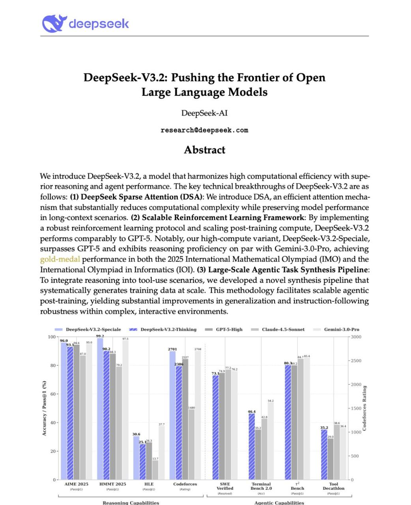

# Image Description

**File:** img_1764668507_aqadhatrg7rteel_image_deepseek_v3_2_pushing.jpg
**Original:** image.jpg
**Received:** 1764668507

## Extracted Text (OCR)

<!-- image -->

## DeepSeek-V3.2: Pushing the Frontier of Open Large Language Models

DeepSeek-Al researchOdeepseek.com

We introduce DeepSeek-V3.2, a model that harmonizes high computational efficiency with superior reasoning and agent performance. [he key technical breakthroughs of DeepSeek-V3.2 are as follows: (1) DeepSeek Sparse Attention (DSA): We introduce DSA, an efficient attention mechanism that substantially reduces computational complexity while preserving model performance in long-context scenarios. (2) Scalable Reinforcement Learning Framework: by implementing a robust reinforcement learning protocol and scaling post-training compute, DeepSeek-V3.2 performs comparably to GPI-5. Notably, our high-compute variant, DeepSeek-V3.2-Speciale, surpasses GPI-5 and exhibits reasoning proficiency on par with Gemini-3.0-Pro, achieving 2o\c-meca. performance in both the 2025 International Mathematical Olympiad (IMO) and the International Olympiad in Informatics (IOI). (3) Large-Scale Agentic Task Synthesis Pipeline: To integrate reasoning into tool-use scenarios, we developed a novel synthesis pipeline that systematically generates training data at scale. This methodology facilitates scalable agentic post-training, yielding substantial improvements in generalization and instruction-following robustness within complex, interactive environments.

<!-- image -->

Reasoning Capahilities Agentic Capabilities

## Usage Instructions

When referencing this image in markdown:
1. Use relative path based on file location
2. Add descriptive alt text based on OCR content above
3. Add text description BELOW the image for GitHub rendering

Example:
```markdown
 <!-- TODO: Broken image path -->

**Image shows:** [Describe what the image contains based on OCR]
```
