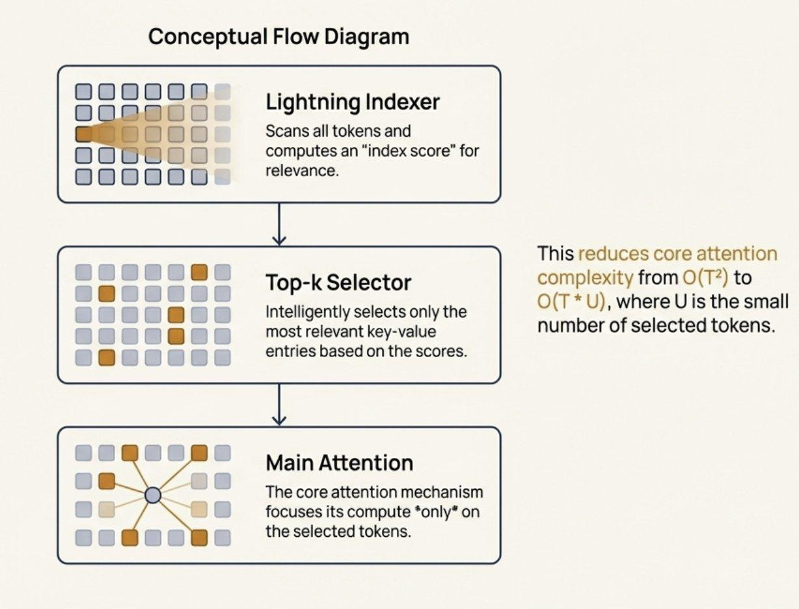

# Image Description

**File:** img_1764668507_aqadhgtrg7rteel_this_reduces_core_attention_top_k_select.jpg
**Original:** image.jpg
**Received:** 1764668507

## Extracted Text (OCR)

This reduces core attention Top-k Selector complexity from O(T?) to J = * | *
Intelligently selects only the | O(T в U) , where UIs the small

most relevant key-value number of selected tokens. entries based onthe scores.

<!-- image -->

## Usage Instructions

When referencing this image in markdown:
1. Use relative path based on file location
2. Add descriptive alt text based on OCR content above
3. Add text description BELOW the image for GitHub rendering

Example:
```markdown
 <!-- TODO: Broken image path -->

**Image shows:** [Describe what the image contains based on OCR]
```
