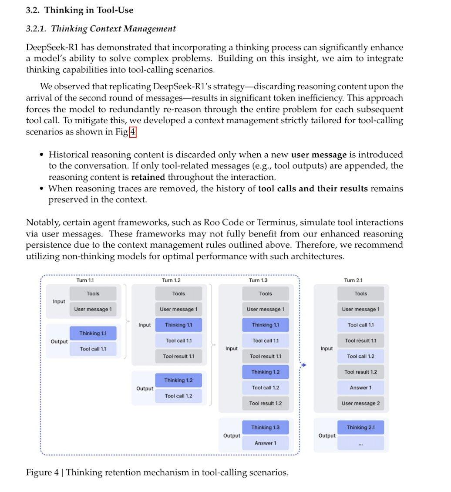

# Image Description

**File:** img_1764668507_aqadigtrg7rteel_3_2_thinking_in_tool_use.jpg
**Original:** image.jpg
**Received:** 1764668507

## Extracted Text (OCR)

## 3.2. Thinking in Tool-Use

## 3.2.1. Thinking Context Management

DeepSeek-K1 has demonstrated that incorporating a thinking process can significantly enhance a model's ability to solve complex problems. Building on this insight, we aim to integrate thinking capabilities into tool-calling scenarios.

We observed that replicating DeepSeek-K1's stratezg y—discarding reasoning content upon the arrival of the second round of messages—results in significant token inefficiency. This approach forces the model to redundantly re-reason through the entire problem for each subsequent tool call. To mitigate this, we developed a context management strictly tailored for tool-calling scenarios as shown in НМ]

- ¢ Historical reasoning content is discarded only when a new user message is introduced to the conversation. If only tool-related messages (e.g., tool outputs) are appended, the reasoning content is retained throughout the interaction.
- ® When reasoning traces are removed, the history of tool calls and their results remains preserved in the context.

Notably, certain agent frameworks, such as Roo Code or Terminus, simulate tool interactions via user messages. These frameworks may not fully benefit from our enhanced reasoning persistence due to the context management rules outlined above. Therefore, we recommend utilizing non-thinking models for optimal performance with such architectures.

Figure 4 | Thinking retention mechanism in tool-calling scenarios.

<!-- image -->

## Usage Instructions

When referencing this image in markdown:
1. Use relative path based on file location
2. Add descriptive alt text based on OCR content above
3. Add text description BELOW the image for GitHub rendering

Example:
```markdown
 <!-- TODO: Broken image path -->

**Image shows:** [Describe what the image contains based on OCR]
```
