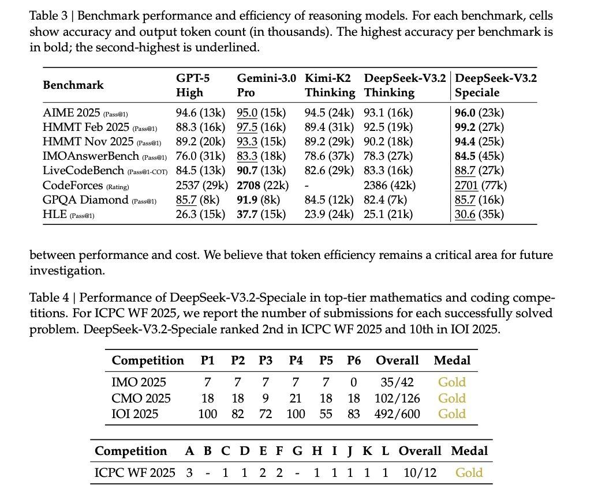

# Image Description

**File:** img_1764668507_aqadjatrg7rteel_table_3_benchmark_performance_and.jpg
**Original:** image.jpg
**Received:** 1764668507

## Extracted Text (OCR)

Table 3 | Benchmark performance and efficiency of reasoning models. For each benchmark, cells show accuracy and output token count (in thousands). [he highest accuracy per benchmark is in bold; the second-highest is underlined.

|                                                                                                                                                                                                                                                                                                                                                                                                                                                                                                                                                                                                          | GPT-5 Gemini-3.0 Kimi-K2 DeepSeek-V3.2 | DeepSeek-V3.2 Benchmark oT — ОИ ae 2 ie ae High  Pro  Thinking Thinking  | Speciale   |
|----------------------------------------------------------------------------------------------------------------------------------------------------------------------------------------------------------------------------------------------------------------------------------------------------------------------------------------------------------------------------------------------------------------------------------------------------------------------------------------------------------------------------------------------------------------------------------------------------------|--------------------------------------------------------------------------------------------------------------------------------|
| AIME 2025 (passa 94.6(13k) 95.0(15k) 94.5 (24k) 93.1 (16k) | 96.0 (23k) HMMT Feb 2025 asa) 88.3(16k) 97.5(16k) 89.4(31k) 92.5 (19k) | 99.2 (27k) HMMT Nov 2025 г.в) 89.2 (20k) 93.3(15k) 89.2 (29k) 90.2 (18k) | 94.4 (25k) IMOAnswerBench (rasa1) 76.0(31k) 83.3 (18К} 78.6 (37k) 78.3 (27k) | 84.5 (45k) LiveCodeBench (rassai-con 84.5(13k) 90.7(13k) 82.6(29k) 83.3 (16k) | 88.7 (27k) CodeForces (rating) 2537 (29k) 2708 (22k) - 2386 (42k) | 2701 (77k) GPOA Diamond газе, 85.7 (8к} 91.9(8k) 6845(12k) 82.4 (7k) | 85.7 (16k) HLE (assay 26.3 (15k) 37.7(15k) 23.9 (24k) 25.1 (21k) | 30.6 (35k) |                                                                                                                                |

between performance and cost. We believe that token efficiency remains a critical area for future investigation.

Table 4 | Performance of DeepSeek-V3.2-Speciale in top-tier mathematics and coding competitions. For ОРС WF 2025, we report the number of submissions for each successfully solved problem. DeepSeek-V3.2-5peciale ranked 2nd in [CPC WE 2025 and 10th in IOI 2025.

| Competition Pl P2 P3 P4 P5 P6 Overall Medal   |                                         |
|-----------------------------------------------|-----------------------------------------|
| IMO 2025 7 ии". и / O 35/42 Gold              |                                         |
| CMO 2025 18 18 9 #21 18 18 102/126 ча         |                                         |
|                                               | LOT 2025 100 8&2 72 Ш 55 83 492/600 Goe |

| Competition A BC DEF GHI J КЕ Overall Medal   |
|-----------------------------------------------|
| CPC WE 2025 3 - 1122-11111 1090/12 #42Gold    |

## Usage Instructions

When referencing this image in markdown:
1. Use relative path based on file location
2. Add descriptive alt text based on OCR content above
3. Add text description BELOW the image for GitHub rendering

Example:
```markdown
 <!-- TODO: Broken image path -->

**Image shows:** [Describe what the image contains based on OCR]
```
