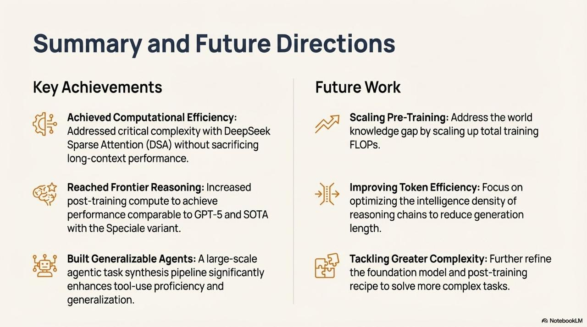

# Image Description

**File:** img_1764668507_aqadjqtrg7rteel_summary_and_future_directions.jpg
**Original:** image.jpg
**Received:** 1764668507

## Extracted Text (OCR)

## Summary and Future Directions

## Key Achievements Future Work

aCe Achieved Computational Efficiency: АЯ Scaling Pre-Training: Address the world
$ Addressed critical complexity with DeepSeek knowledae aap by scaling up total trainin

6 Addressed critical complexity with DeepSeek " ~ knowledge gap by scaling up total training Sparse Attention (DSA) without sacrificing FLOPs. iong-context performance.

<!-- image -->

<!-- image -->

<!-- image -->

<!-- image -->

1$ Reached Frontier Reasoning: Increased If 5 Improving Token Efficiency: Focus on
ey nost-trainina compute to achieve =. gptimizina the intelligence density of 2 post-training compute to achieve "2° — optimizing the intelligence density of performance comparable to GPT-5 and SOTA reasoning chains to reduce generation with the speciale variant. length.

<!-- image -->

Built Generalizable Agents: A large-scale -.2,) Tackling Greater Complexity: Further refine

<!-- image -->

BML Vee anleavite AUIS: MIG OVI uy А о А-В
agentic task synthesis pipeline significantly ea the foundation model and post-training enhances tool-use proficiency and recipe to solve more complex tasks. generalization.

## Usage Instructions

When referencing this image in markdown:
1. Use relative path based on file location
2. Add descriptive alt text based on OCR content above
3. Add text description BELOW the image for GitHub rendering

Example:
```markdown
 <!-- TODO: Broken image path -->

**Image shows:** [Describe what the image contains based on OCR]
```
