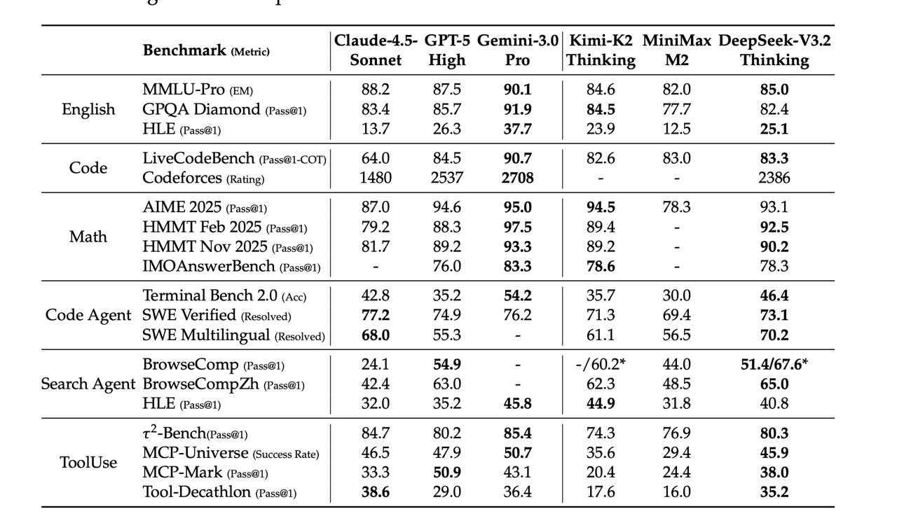

# Image Description

**File:** img_1764669521_aqadtq9rgx7cul_claude_4_5.jpg
**Original:** image.jpg
**Received:** 1764669521

## Extracted Text (OCR)

|                                                                                                                                                              |                                                  | | Claude-4. 5- GPT-5 Gemini-3. 0 Kimi-K2 MiniMax DeepSeek-V3 .2 Benchmark (Metric) me 2 cari (Metric)  Sonnet High Pro |Thinking M2 Thinking   |
|--------------------------------------------------------------------------------------------------------------------------------------------------------------|--------------------------------------------------|------------------------------------------------------------------------------------------------------------------------------------------------|
| MMILU-Pro (Em) | 55.2 Бу) 90.1 | 94.6 62.0) 85.0 English GPQA Diamond (Pas@1) | 83.4 85.7 91.9 | 84.5 77.7 82.4 HLE (Pass@1) | 3.7 26.3 37.7 | 239 12.5 25.1 |                                                  |                                                                                                                                                |
| Соае LiveCodeBench (Pass@1-COT) 64.0 84.5 90.7 82.6 83.0 83. 3                                                                                               |                                                  |                                                                                                                                                |
| Codeforces (Rating) | 1480 2537 2708 | - - 2386                                                                                                              |                                                  |                                                                                                                                                |
| AIME 2025 (Pass@1)  5/.0  94.6  95.0  94.5  /8.3  93.1 Math НММТ Feb 2025 разв) | 792 88.35 97.5 | 894                                                       |                                                  |                                                                                                                                                |
| HMMIT Nov 2025 (Pass@1) | М 89.2 93.3 | 89.2 - 90.2                                                                                                          |                                                  |                                                                                                                                                |
| IMOAnswerBench (Pass@1) | - 76.0 83.3 | 78.6 - 19.3                                                                                                          |                                                  |                                                                                                                                                |
| Code Agent SWE Verified (Resolved) | 77. 74.9 76.2 | 11.3 69.4 73.1                                                                                          |                                                  |                                                                                                                                                |
| SWE Multilingual (Resolved)| 68.0 99.3 - | 61.1 26.5 70.2                                                                                                    |                                                  |                                                                                                                                                |
| BrowseComp (Pass@1) | 24.1 54.9 - | -/60.2* 44.0 51.4/67.6*                                                                                                  |                                                  |                                                                                                                                                |
| search Agent BrowseCompZh (Pass@1) | 424 63.0 - | 62.3 48.5 65.0                                                                                             |                                                  |                                                                                                                                                |
| НЕН (Pass@1) | ‘32.0 35.2 458 | 44.9 31.8 40.8                                                                                                               | t--BenchiPass@1) | 847 80.2 85.4 | 743 76.9 80.3 |                                                                                                                                                |
| MCP-Universe (Success Rate) 46.5 479 50.7 35.6 29.4 45.9 ToolUse > ar a oon ~~" a — < NACP-Mark (Pass@1) | 333 50.9 431 | 204 24.4 38.0                      |                                                  |                                                                                                                                                |
| Tool-Decathlion (Pass@1) | 38.6 29.0 36.4 | 17.6 16.0 35.2                                                                                                   |                                                  |                                                                                                                                                |

## Usage Instructions

When referencing this image in markdown:
1. Use relative path based on file location
2. Add descriptive alt text based on OCR content above
3. Add text description BELOW the image for GitHub rendering

Example:
```markdown
 <!-- TODO: Broken image path -->

**Image shows:** [Describe what the image contains based on OCR]
```
