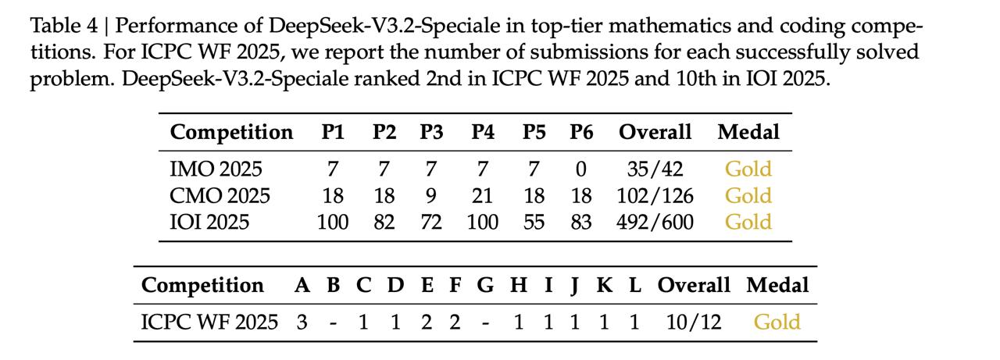

# Image Description

**File:** img_1764669521_aqadxg9rgx7cul_table_4_performance_of_deepseek_v3_2_spe.jpg
**Original:** image.jpg
**Received:** 1764669521

## Extracted Text (OCR)

Table 4 | Performance of DeepSeek-V3.2-Speciale in top-tier mathematics and coding competitions. For ICPC WE 2025, we report the number of submissions for each successfully solved problem. DeepSeek-V3.2-Speciale ranked 2nd in ICPC WE 2025 and 10th in IOI 2025.

| Competition Pl P2 P3 P4 P5 P6 Overall Medal   |                                          |
|-----------------------------------------------|------------------------------------------|
| IMO 2025 О 35/42 Gold                         |                                          |
| CMO 2025 18 18 9 Л 18 18 102/126 Gole         |                                          |
|                                               | LOT 2025 100 82 72 100 55 83 492/600 Goc |

| Competition A BCD EF GHI J КЕ Overall Medal   |
|-----------------------------------------------|
| ICPC WE 2025 3 - 1122-11111 10/12 Goe         |

## Usage Instructions

When referencing this image in markdown:
1. Use relative path based on file location
2. Add descriptive alt text based on OCR content above
3. Add text description BELOW the image for GitHub rendering

Example:
```markdown
 <!-- TODO: Broken image path -->

**Image shows:** [Describe what the image contains based on OCR]
```
