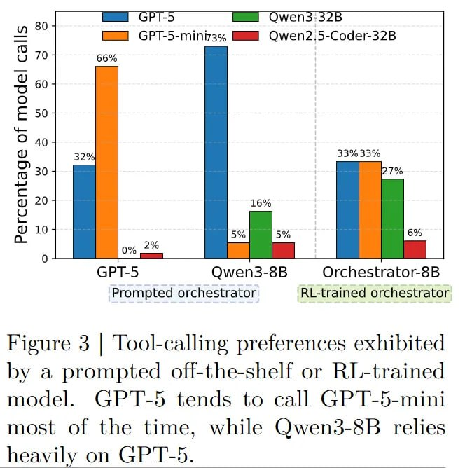

# Image Description

**File:** img_1764747677_aqadcatrgwnygul9_figure_3_tool_calling_preferences_exhibi.jpg
**Original:** image.jpg
**Received:** 1764747677

## Extracted Text (OCR)

Figure 3 | Tool-calling preferences exhibited by a prompted off-the-shelf or RL-trained model. GPT-5 tends to call СРТ-5-ти most of the time, while Qwen3-8B relies heavily on GP'I-5.

<!-- image -->

## Usage Instructions

When referencing this image in markdown:
1. Use relative path based on file location
2. Add descriptive alt text based on OCR content above
3. Add text description BELOW the image for GitHub rendering

Example:
```markdown
 <!-- TODO: Broken image path -->

**Image shows:** [Describe what the image contains based on OCR]
```
