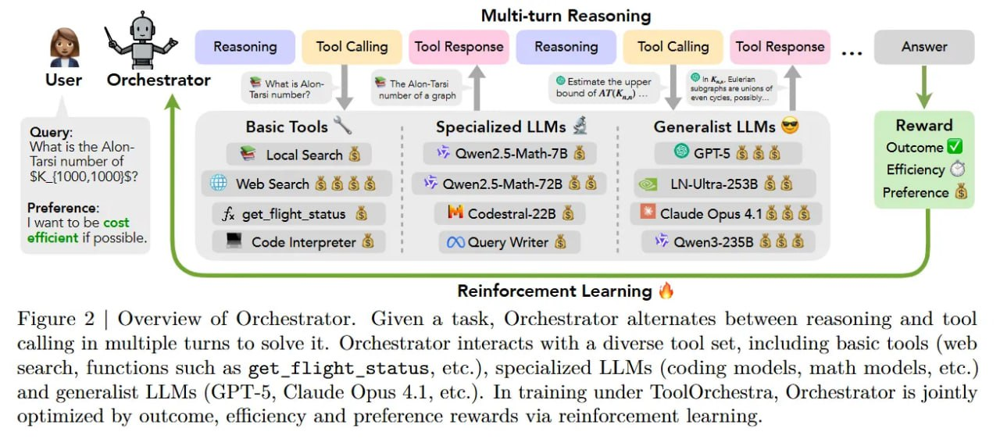

# Image Description

**File:** img_1764747677_aqadcqtrgwnygul_figure_2_overview_of_orchestrator.jpg
**Original:** image.jpg
**Received:** 1764747677

## Extracted Text (OCR)

Figure 2 | Overview of Orchestrator. Given a task, Orchestrator alternates between reasoning and tool calling in multiple turns to solve it. Orchestrator interacts with a diverse tool set, including basic tools (web search, functions such as get\_flight\_status, etc.), specialized LLMs (coding models, math models, etc.) and generalist LLMs (GPT-5, Claude Opus 4.1, etc.). In training under ToolOrchestra, Orchestrator is jointly optimized by outcome, efhiciency and preference rewards via reintorcement, learning.

<!-- image -->

## Usage Instructions

When referencing this image in markdown:
1. Use relative path based on file location
2. Add descriptive alt text based on OCR content above
3. Add text description BELOW the image for GitHub rendering

Example:
```markdown
 <!-- TODO: Broken image path -->

**Image shows:** [Describe what the image contains based on OCR]
```
