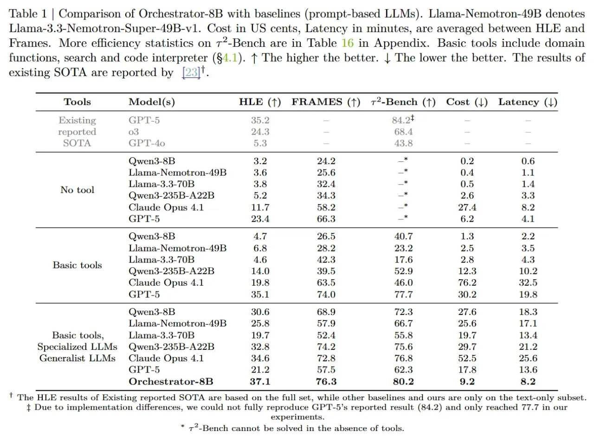

# Image Description

**File:** img_1764747677_aqadcwtrgwnygul_table_1_comparison_of_orchestrator_8b.jpg
**Original:** image.jpg
**Received:** 1764747677

## Extracted Text (OCR)

Table 1 | Comparison of Orchestrator-8B with baselines (prompt-based LLMs). Llama-Nemotron-49B denotes Llama-3.3-Nemotron-Super-49B-vl. Cost in US cents, Latency in minutes, are averaged between HLE and Frames. More efficiency statistics on 7*-Bench are in Table 16 in Appendix. Basic tools include domain functions, search and code interpreter (54.1). Т The higher the better. | The lower the better. The results of existing SOTA are reported by [23]'.

|                                                             | Tools Model(s) HLE (1) FRAMES (1) 17*-Bench (1) Cost (|) Latency (1)   |
|-------------------------------------------------------------|------------------------------------------------------------------------|
| Existing  СРТ-5  35.2                                       |                                                                        |
| reported 03 24.3 — 68.4                                     |                                                                        |
| (Jwen3-8B  5  24.2  0.2  0.6                                |                                                                        |
| Lilama-Nemotron-4d9B  95 6  Од  11                          |                                                                        |
| Llama-3. 3- тов 3.8 32.4 —* 0.5  а = ee — =— о ee ПС a  1.4 |                                                                        |
| (Jwen3-235B-A22B  5.2  2.6  -                               |                                                                        |
| Claude Opus 4.1  11.7  58.2  27.4  8.2                      |                                                                        |
| 6.2  41                                                     |                                                                        |
| ()wen3-8B  AT  26.5  40.7  1.3  2.2                         |                                                                        |
| Llama-Nemotron-19B  6.8  oR о  93 9                         |                                                                        |
| Basic tools Haar (OB |                                      |                                                                        |
| (wen3-235B-A22B 14.0 39.5 52.9 12.3 10.2                    |                                                                        |
| Claude Opus 4.1 19.8 63.5 46.0 76.2 32.0                    |                                                                        |
| (-PT-5 35 1 TAD УГ 302 19.8                                 |                                                                        |
| (Jwen3-85 30.6 68.9 72.3 27.6 18.3                          |                                                                        |
| Llama-Nemotron-49B On 5 579 66.7 95 6 17.1                  |                                                                        |
| Basic tools, Llama-3.3-70B 19.7 52.4 55.8 19.7 13.4         |                                                                        |
| Specialized LLMs Qwen3-235B-A22B 32.8 74.2 75.6 29.7 2].2   |                                                                        |
| Generalist LLMs Claude Opus 4.1 34.6 72.8 76.8 52.0 25.6    |                                                                        |
| (2177-5  9] 2  БУВ  623  175  136                           |                                                                        |
| ()rchestrator-3B  37.1  76.3  580.2  9.2  5.2               |                                                                        |

' The HLE results of Existing reported SOTA are based on the full set, while other baselines and ours are only on the text-only subset. + Due to implementation differences, we could not fully reproduce GPT-5's reported result (84.2) and only reached 77.7 in our experiments.

r*\_Ronch cannot Бе «ое in the absence of tools:

## Usage Instructions

When referencing this image in markdown:
1. Use relative path based on file location
2. Add descriptive alt text based on OCR content above
3. Add text description BELOW the image for GitHub rendering

Example:
```markdown
 <!-- TODO: Broken image path -->

**Image shows:** [Describe what the image contains based on OCR]
```
