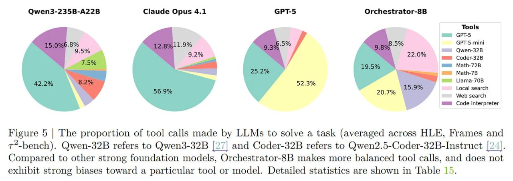

# Image Description

**File:** img_1764747677_aqaddatrgwnygul_figure_5_the_proportion_of.jpg
**Original:** image.jpg
**Received:** 1764747677

## Extracted Text (OCR)

Figure 5 | The proportion of tool calls made by LLMs to solve a task (averaged across HLE, Frames and T*-bench). Qwen-32B refers to Qwen3-32B [27] and Coder-32B refers to Qwen2.5-Coder-32B-Instruct [24]. Compared to other strong foundation models, Orchestrator-8B makes more balanced tool calls, and does not exhibit strong biases toward a particular tool or model. Detailed statistics are shown in Table 15.

<!-- image -->

## Usage Instructions

When referencing this image in markdown:
1. Use relative path based on file location
2. Add descriptive alt text based on OCR content above
3. Add text description BELOW the image for GitHub rendering

Example:
```markdown
 <!-- TODO: Broken image path -->

**Image shows:** [Describe what the image contains based on OCR]
```
