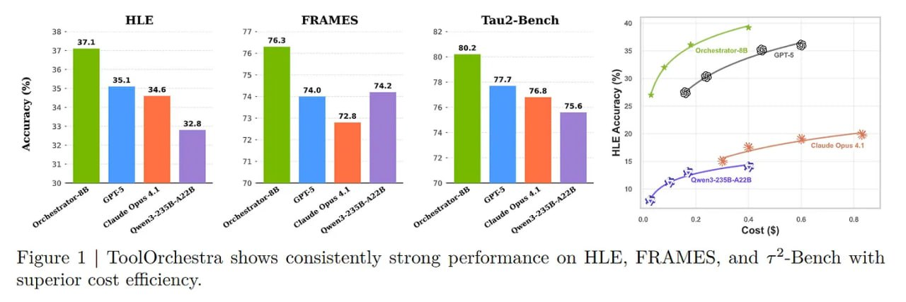

# Image Description

**File:** img_1764747677_aqaddqtrgwnygul_figure_1_toolorchestra_shows_consistentl.jpg
**Original:** image.jpg
**Received:** 1764747677

## Extracted Text (OCR)

Figure 1 | ToolOrchestra shows consistently strong performance оп HLE, FRAMES, and r?-Bench with superior cost efhiciency.

<!-- image -->

## Usage Instructions

When referencing this image in markdown:
1. Use relative path based on file location
2. Add descriptive alt text based on OCR content above
3. Add text description BELOW the image for GitHub rendering

Example:
```markdown
 <!-- TODO: Broken image path -->

**Image shows:** [Describe what the image contains based on OCR]
```
