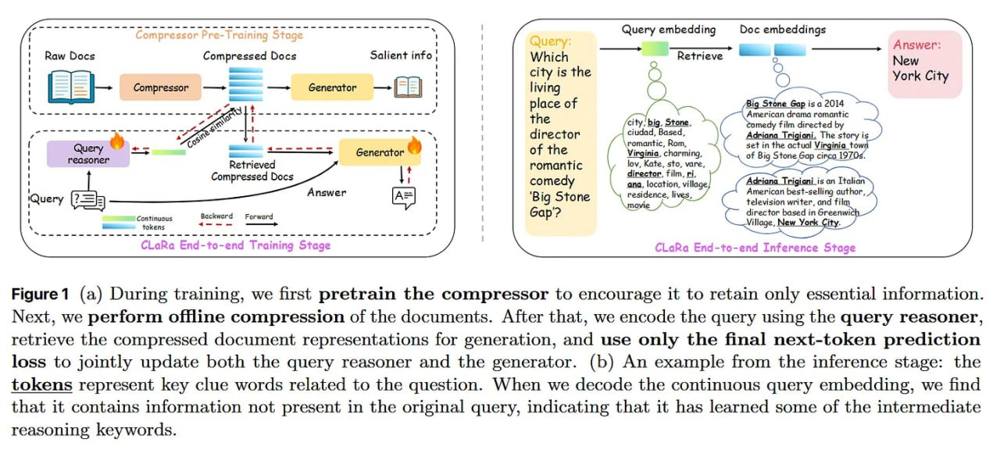

# Image Description

**File:** img_1764813556_aqadrq1rg9j4iul_image_figure_1_a.jpg
**Original:** image.jpg
**Received:** 1764813556

## Extracted Text (OCR)

<!-- image -->

Figure 1 (a) During training, we first pretrain the compressor to encourage it to retain only essential information. Next, we perform offline compression of the documents. After that, we encode the query using the query reasoner, retrieve the compressed document representations for generation, and use only the final next-token prediction loss to jointly update both the query reasoner and the generator. (b) An example from the inference stage: the tokens represent key clue words related to the question. When we decode the continuous query embedding, we find that it contains information not present in the original query, indicating that it has learned some of the intermediate reasoning keywords.

## Usage Instructions

When referencing this image in markdown:
1. Use relative path based on file location
2. Add descriptive alt text based on OCR content above
3. Add text description BELOW the image for GitHub rendering

Example:
```markdown
 <!-- TODO: Broken image path -->

**Image shows:** [Describe what the image contains based on OCR]
```
