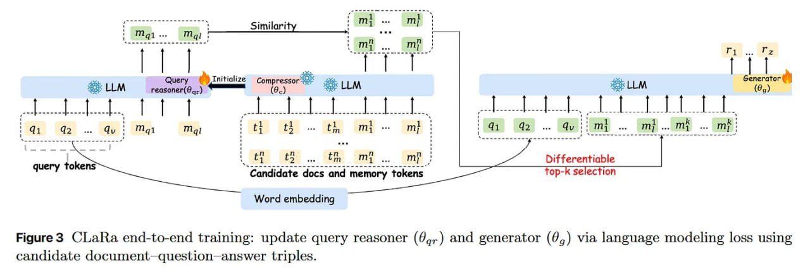

# Image Description

**File:** img_1764813556_aqadsa1rg9j4iul_figure3_clara_end_to_end_training_update.jpg
**Original:** image.jpg
**Received:** 1764813556

## Extracted Text (OCR)

Figure3 CLaRa end-to-end training: update query reasoner (@,,) and generator (@,) via language modeling loss using candidate document—question—answer triples.

<!-- image -->

## Usage Instructions

When referencing this image in markdown:
1. Use relative path based on file location
2. Add descriptive alt text based on OCR content above
3. Add text description BELOW the image for GitHub rendering

Example:
```markdown
 <!-- TODO: Broken image path -->

**Image shows:** [Describe what the image contains based on OCR]
```
