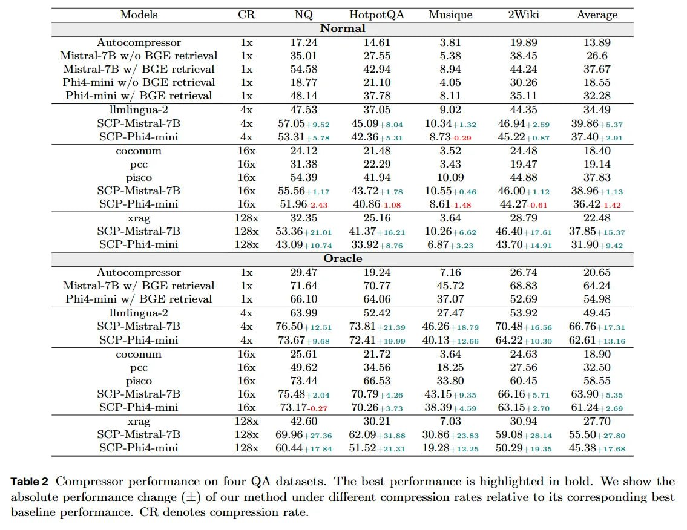

# Image Description

**File:** img_1764813556_aqadsg1rg9j4iul_table_2_compressor_performance_on_four.jpg
**Original:** image.jpg
**Received:** 1764813556

## Extracted Text (OCR)

Table 2 Compressor performance on four QA datasets. 'The best performance is highlighted m bold. We show the absolute performance change (--) of our method under different compression rates relative to its corresponding best baseline performance. CR denotes compression rate.

|                                                                                                                                                                                                                 | Models a NQ HotpotQA Musique 2Wiki Average                                                                                                                                                                                                                                                                                                                                                                                |         |         |         |         |         |
|-----------------------------------------------------------------------------------------------------------------------------------------------------------------------------------------------------------------|---------------------------------------------------------------------------------------------------------------------------------------------------------------------------------------------------------------------------------------------------------------------------------------------------------------------------------------------------------------------------------------------------------------------------|---------|---------|---------|---------|---------|
| Normal                                                                                                                                                                                                          | Normal                                                                                                                                                                                                                                                                                                                                                                                                                    | Normal  | Normal  | Normal  | Normal  | Normal  |
| Autocompressor 1х 17.24 14.61 3.81 19.89 13.89                                                                                                                                                                  | Mistral-7B w/o ВСЕ retrieval 1х 35.01 27.55 5.38 38.45 26.6 Mistral-7B w/ BGE retrieval 1х 54.58 42.934 8.94 44.24 37.67                                                                                                                                                                                                                                                                                                  |         |         |         |         |         |
| (Jracle                                                                                                                                                                                                         | (Jracle                                                                                                                                                                                                                                                                                                                                                                                                                   | (Jracle | (Jracle | (Jracle | (Jracle | (Jracle |
| Autocompressor 1х 29.47 19.24 7.16 26.74 20.65 Mistral-7B w/ BGE retrieval 1х 71.64 70.77 45.72 68.83 64.24 Phi4-mini w/ BGE retrieval 1х 66.10 64.06 37.07 52.69 54.98                                         | Phi4-mini w/o BGE retrieval 1х 18.77 21.10 4.05 30.26 18.55 Phi4-mini w/ BGE retrieval 1х 48.14 37.78 8.11 35.11 32.28 limlingua-2 Ax 47.53 of 05 9.02 44.359 34.49 SC P-Mistral-7B Ax 57.05 19.52 45.09 | 8.04 10.34) 1.32 46.94 | 9.59 39.86) 5.37 SC; P-Phi4-mini Ax 53.31 15.78 A? 3615.31 8&.73-0.29 A522 | 0.87 37.40 | 2.91 COcOnUMG  lox  24 12  21.48  3.52  18.40 pce lox 31.38 22.24 3.43 19.47 19.14          |         |         |         |         |         |
|                                                                                                                                                                                                                 | Disco lox 54.39 41.94 10.09 44.88 27.83 SC) P-Mustral-7B lox 55.56) 4.17 43.72: 178 10.55 | 0.46 A6.00 | 1.12 38.96) 1.13 SC P-Phi4-mini lox 51 .96-3.49 40.56 гов &8&.61-1.48 AA Тб би 36.472 т 42 хгар 128х а.о 20.16 3.64 20.19 22.48 S()P-Mistral-7B 128х 4532.36) 21.01 A4L1.37) 16.21 10.26 | 6.62 46.40);17.61 37.35) 15.37 S(;P-Phi4-mini 128x 43.09) 10.74 40.92 | 8.76 6.8/7 | 3.293 43.70 | 14.91 31.90 | 9.42 |         |         |         |         |         |
| imlingua-2 Ax 63.99 52.42 2г.Дт 53.92 49.15 S()P-Whistral-/7B Ax 16.50 | 12.51 fa.8l)21.39 46.26) 18.79 10.48 1556 66.76) 17.31 SC) P-Phi4z-mini Ay Ta.O7f 19.68 724] 1209 40.13 12966 64.22 :10.30 626111315   |                                                                                                                                                                                                                                                                                                                                                                                                                           |         |         |         |         |         |
| COCcCOMII: lox 95 61 ee aa a 4.64 24 63 18.90) pce 16х 49.62 04.56 18.25 27.56 32.5 Disco lox (3.44 66.53 33.80 60.45 58.05 S(P-Mistral-7bB l6x 15.48 | 2.04 10.79 | 4.26 43.]1519.35 66.16) 5.714 63.90 | 5.35 |                                                                                                                                                                                                                                                                                                                                                                                                                           |         |         |         |         |         |
| SC) P-Phi4-mini lox fa.l f-0.27 70.26 | 3.73 38.39 | 4.59 63.15 | 2.70 61.24 | 2.69 хгар 128х 42.60 30.21 7.05 30.94 27.10                                                                                      |                                                                                                                                                                                                                                                                                                                                                                                                                           |         |         |         |         |         |
| SC; P-Phi4-mini 128x 60.44, 1i7.84 51.52) 21.31 19.28 1225 50.29) 19.55 45.38) 17.62                                                                                                                            |                                                                                                                                                                                                                                                                                                                                                                                                                           |         |         |         |         |         |
| SC) P-Miustral-7B 28x 69.96) 27.36 62.09) 31.88 30.86/)28.s8 59.08 ;o8.14 £55.50) 27.80                                                                                                                         |                                                                                                                                                                                                                                                                                                                                                                                                                           |         |         |         |         |         |

## Usage Instructions

When referencing this image in markdown:
1. Use relative path based on file location
2. Add descriptive alt text based on OCR content above
3. Add text description BELOW the image for GitHub rendering

Example:
```markdown
 <!-- TODO: Broken image path -->

**Image shows:** [Describe what the image contains based on OCR]
```
