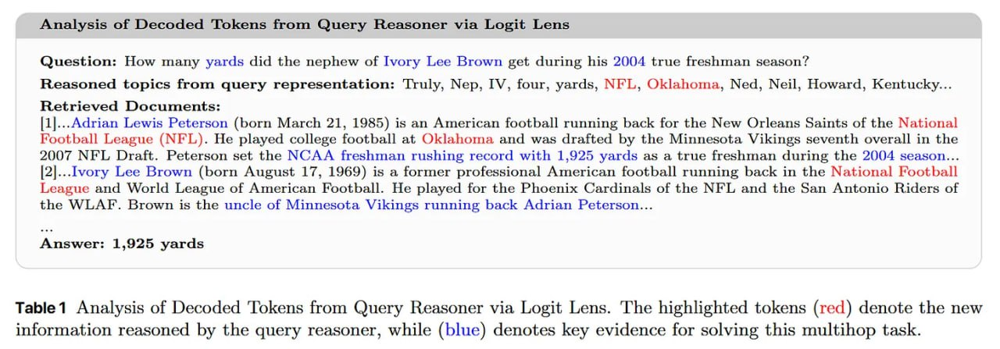

# Image Description

**File:** img_1764813556_aqadsq1rg9j4iul_image_table1_analysis_of.jpg
**Original:** image.jpg
**Received:** 1764813556

## Extracted Text (OCR)

<!-- image -->

Table1 Analysis of Decoded 'Tokens from Query Reasoner via Logit Lens. 'The highlighted tokens (red) denote the new information reasoned by the query reasoner, while (blue) denotes key evidence for solving this multihop task.

## Usage Instructions

When referencing this image in markdown:
1. Use relative path based on file location
2. Add descriptive alt text based on OCR content above
3. Add text description BELOW the image for GitHub rendering

Example:
```markdown
 <!-- TODO: Broken image path -->

**Image shows:** [Describe what the image contains based on OCR]
```
