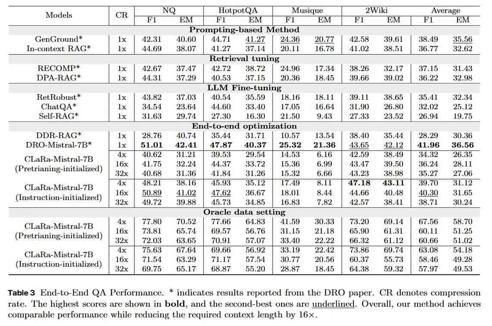

# Image Description

**File:** img_1764813556_aqadsw1rg9j4iul_table_3_end_to_end_qa_performance.jpg
**Original:** image.jpg
**Received:** 1764813556

## Extracted Text (OCR)

Table 3 End-to-End QA Performance. * indicates results reported from the DRO paper. CR. denotes compression rate. 'The highest scores are shown in bold, and the second-best ones are underlined. Overall, our method achieves comparable performance while reducing the required context length by 16x.

| Models CR  FI EM Rl BEM HI АМ Fl BRM HI EM                                                                                                                                                                                                                                                                                                                                                                                                                                                                                                                                                                                                                                                                                                                                                                                                                           | vf tT  HotpotQA  Musique  Average                                                                                                                 | vf tT  HotpotQA  Musique  Average                                                                                                  |                                                                                                                                     |                                                                                             |                                                                                             |                                                                                             |                                                                                             |                                                                                             |                                                                                             |                                                                                             |                                                                                             |
|----------------------------------------------------------------------------------------------------------------------------------------------------------------------------------------------------------------------------------------------------------------------------------------------------------------------------------------------------------------------------------------------------------------------------------------------------------------------------------------------------------------------------------------------------------------------------------------------------------------------------------------------------------------------------------------------------------------------------------------------------------------------------------------------------------------------------------------------------------------------|---------------------------------------------------------------------------------------------------------------------------------------------------|------------------------------------------------------------------------------------------------------------------------------------|-------------------------------------------------------------------------------------------------------------------------------------|---------------------------------------------------------------------------------------------|---------------------------------------------------------------------------------------------|---------------------------------------------------------------------------------------------|---------------------------------------------------------------------------------------------|---------------------------------------------------------------------------------------------|---------------------------------------------------------------------------------------------|---------------------------------------------------------------------------------------------|---------------------------------------------------------------------------------------------|
| Prompting-based Method                                                                                                                                                                                                                                                                                                                                                                                                                                                                                                                                                                                                                                                                                                                                                                                                                                               | Prompting-based Method                                                                                                                            | Prompting-based Method                                                                                                             | Prompting-based Method                                                                                                              | Prompting-based Method                                                                      | Prompting-based Method                                                                      | Prompting-based Method                                                                      | Prompting-based Method                                                                      | Prompting-based Method                                                                      | Prompting-based Method                                                                      | Prompting-based Method                                                                      | Prompting-based Method                                                                      |
| (ten(sronnd* In-context R.ACG*                                                                                                                                                                                                                                                                                                                                                                                                                                                                                                                                                                                                                                                                                                                                                                                                                                       |                                                                                                                                                   |                                                                                                                                    | Ix | 42.31 AD.60 | 44.71 ALO | 24.56 20.77 | 432.58 539.61 | 38.49 35.56                                                            |                                                                                             |                                                                                             |                                                                                             |                                                                                             |                                                                                             |                                                                                             |                                                                                             |                                                                                             |
| 1х | 4469 338.07 | 41.27 37.14 | 20-11 16.78 | 41.02 38.51 | 36.77 = 32.62 Hetrieval tuning                                                                                                                                                                                                                                                                                                                                                                                                                                                                                                                                                                                                                                                                                                                                                                          | 1х | 4469 338.07 | 41.27 37.14 | 20-11 16.78 | 41.02 38.51 | 36.77 = 32.62 Hetrieval tuning                                                       | 1х | 4469 338.07 | 41.27 37.14 | 20-11 16.78 | 41.02 38.51 | 36.77 = 32.62 Hetrieval tuning                                        | 1х | 4469 338.07 | 41.27 37.14 | 20-11 16.78 | 41.02 38.51 | 36.77 = 32.62 Hetrieval tuning                                         | 1х | 4469 338.07 | 41.27 37.14 | 20-11 16.78 | 41.02 38.51 | 36.77 = 32.62 Hetrieval tuning | 1х | 4469 338.07 | 41.27 37.14 | 20-11 16.78 | 41.02 38.51 | 36.77 = 32.62 Hetrieval tuning | 1х | 4469 338.07 | 41.27 37.14 | 20-11 16.78 | 41.02 38.51 | 36.77 = 32.62 Hetrieval tuning | 1х | 4469 338.07 | 41.27 37.14 | 20-11 16.78 | 41.02 38.51 | 36.77 = 32.62 Hetrieval tuning | 1х | 4469 338.07 | 41.27 37.14 | 20-11 16.78 | 41.02 38.51 | 36.77 = 32.62 Hetrieval tuning | 1х | 4469 338.07 | 41.27 37.14 | 20-11 16.78 | 41.02 38.51 | 36.77 = 32.62 Hetrieval tuning | 1х | 4469 338.07 | 41.27 37.14 | 20-11 16.78 | 41.02 38.51 | 36.77 = 32.62 Hetrieval tuning | 1х | 4469 338.07 | 41.27 37.14 | 20-11 16.78 | 41.02 38.51 | 36.77 = 32.62 Hetrieval tuning |
| RERCOMP* DPA-R AC{*                                                                                                                                                                                                                                                                                                                                                                                                                                                                                                                                                                                                                                                                                                                                                                                                                                                  |                                                                                                                                                   | 44.31 37.29 | 40.58 97.15 | 20-86 18.45 | 39.66 39.02 | 36.22 32.98                                                                | AO 67 STAT | 42.72 ЗЫ. 72 | 24.96 17.54 | 33.25 ЗГТ | 37.15 31.43                                                                   |                                                                                             |                                                                                             |                                                                                             |                                                                                             |                                                                                             |                                                                                             |                                                                                             |                                                                                             |
| LLM Fine-tuning                                                                                                                                                                                                                                                                                                                                                                                                                                                                                                                                                                                                                                                                                                                                                                                                                                                      | LLM Fine-tuning                                                                                                                                   | LLM Fine-tuning                                                                                                                    | LLM Fine-tuning                                                                                                                     | LLM Fine-tuning                                                                             | LLM Fine-tuning                                                                             | LLM Fine-tuning                                                                             | LLM Fine-tuning                                                                             | LLM Fine-tuning                                                                             | LLM Fine-tuning                                                                             | LLM Fine-tuning                                                                             | LLM Fine-tuning                                                                             |
| Ret Robust* 1x ChatQA* Ix Self-RAG* lx ChatQA* Self АС                                                                                                                                                                                                                                                                                                                                                                                                                                                                                                                                                                                                                                                                                                                                                                                                               |                                                                                                                                                   | 31.63 29 ТА | 27.30 16.30 | 21.50 O45 | 2733 253.52 | 46.94 19.75                                                                  | Att hat) a7 []3 | АОБА 7 29 | 18.16 19| 3911 зы ВБР | 35 AL ty SA 34 54 2364 | 44.60 433.40 | 17.05 16.64 | 390 96.80 | 3202 25.132 |                                                                                             |                                                                                             |                                                                                             |                                                                                             |                                                                                             |                                                                                             |                                                                                             |                                                                                             |
| Knd-to-end optimization                                                                                                                                                                                                                                                                                                                                                                                                                                                                                                                                                                                                                                                                                                                                                                                                                                              | Knd-to-end optimization                                                                                                                           | Knd-to-end optimization                                                                                                            | Knd-to-end optimization                                                                                                             | Knd-to-end optimization                                                                     | Knd-to-end optimization                                                                     | Knd-to-end optimization                                                                     | Knd-to-end optimization                                                                     | Knd-to-end optimization                                                                     | Knd-to-end optimization                                                                     | Knd-to-end optimization                                                                     | Knd-to-end optimization                                                                     |
| DDR-RAG* (O-Mistral-7B*  aRa-Mistral-7B ‘janing-initialized)  aRa-Mistral-7B  uction-initialized)  1х | 28.76 40.74 | 35.44 31.71 10.57 13.54 | 38.40 35.44 | 28.29 30.36 1х | 51.01 42.41 | 47.87 40.37 | 25.32 21.36 | 43.65 42.12 | 41.96 36.58 4х | 40.62 31.21 | 39.53 29.54 14.53 6.16 | 4259 38.49 | 34.32 26.35 16x | 4175 32.24 | 44.37 33.72 | 15.36 6.99 43.47 39.50 | 36.24 28.11 32x | 40.68 31.36 | 41.84 31.26 | 15.32 6.66 43.23 38.98 | 35.27 27.06 4х | 48.21 38.16 | 45.93 35.12 | 17.49 8.11 47.18 43.11 397 31.12 16x | 50.89 41.02 | 47.62 36.67 | 18.01 8.44 44.66 40.48 | 40.30 31.65 32x | 49.72 39.88 | 45.73 34.85 | 16.83 7.82 42.57 38.41 | 38.71 30.24 DRO-Mistral-7B* | ix | 51.01 429.41 | 47.87 40.37 | 2532 21.36 | 4265 492.19 | 4196 236.56 CLaRa-MistraL7R | 4Х | 99.62 31.2 | 3958 29.54 | №58 6.16 | 4259 38.49 | 34.32 26.30 |                                                                                                                                                   |                                                                                                                                    |                                                                                                                                     |                                                                                             |                                                                                             |                                                                                             |                                                                                             |                                                                                             |                                                                                             |                                                                                             |                                                                                             |
| (Pretrianing-initialized )                                                                                                                                                                                                                                                                                                                                                                                                                                                                                                                                                                                                                                                                                                                                                                                                                                           |                                                                                                                                                   | AL.75 3724 | 44 37 393.72 | 15.36 6.99 | 43.47 39.50 | 36.24 5 |] AD.6R 31.36 | 41.84 31.28 | 15.32 6.66 | 4323 38.95 | 3527 77.06 |                                                                                                                                     |                                                                                             |                                                                                             |                                                                                             |                                                                                             |                                                                                             |                                                                                             |                                                                                             |                                                                                             |
|                                                                                                                                                                                                                                                                                                                                                                                                                                                                                                                                                                                                                                                                                                                                                                                                                                                                      |                                                                                                                                                   | 2.89 41.2 | 4762 36.67 | 130 АА | 44.66 4.48 | 40.30 31.65                                                                         | Aw 2] 32°16 | 45.03 3519 | 17.40 ЗЕ | 47.18 48.11 | 39.70 31.12                                                                     |                                                                                             |                                                                                             |                                                                                             |                                                                                             |                                                                                             |                                                                                             |                                                                                             |                                                                                             |
| (Instruction-initialized }                                                                                                                                                                                                                                                                                                                                                                                                                                                                                                                                                                                                                                                                                                                                                                                                                                           |                                                                                                                                                   |                                                                                                                                    |                                                                                                                                     |                                                                                             |                                                                                             |                                                                                             |                                                                                             |                                                                                             |                                                                                             |                                                                                             |                                                                                             |
|                                                                                                                                                                                                                                                                                                                                                                                                                                                                                                                                                                                                                                                                                                                                                                                                                                                                      |                                                                                                                                                   | AQ "72 SO.88 | 45.73 34.85 | 1688 1.62 | 42.457 35.41 | ЗЕ 30.24                                                                   |                                                                                                                                     |                                                                                             |                                                                                             |                                                                                             |                                                                                             |                                                                                             |                                                                                             |                                                                                             |                                                                                             |
|                                                                                                                                                                                                                                                                                                                                                                                                                                                                                                                                                                                                                                                                                                                                                                                                                                                                      | Oracle data setting ты} 7] 52 | 7766 в | 459 40 33 | 73.20 640.14 | 87 5A6 AR 70 72231 6574 | 6957 £456.76 | 31.15 1.18 | 65.90 £61.31 | И £51.25 |                                                                                                                                    |                                                                                                                                     |                                                                                             |                                                                                             |                                                                                             |                                                                                             |                                                                                             |                                                                                             |                                                                                             |                                                                                             |
| (Pretrianing-initialized )                                                                                                                                                                                                                                                                                                                                                                                                                                                                                                                                                                                                                                                                                                                                                                                                                                           |                                                                                                                                                   |                                                                                                                                    |                                                                                                                                     |                                                                                             |                                                                                             |                                                                                             |                                                                                             |                                                                                             |                                                                                             |                                                                                             |                                                                                             |
|                                                                                                                                                                                                                                                                                                                                                                                                                                                                                                                                                                                                                                                                                                                                                                                                                                                                      | 5692 | 3319 99 AD | FARE 60.74 | 63.08 54 18                                                                                                      | v2 3 63.65 | 7091 By OF | 3314 799 | БВ 3 61.12 | #066 5] 0)?                                                                      |                                                                                                                                     |                                                                                             |                                                                                             |                                                                                             |                                                                                             |                                                                                             |                                                                                             |                                                                                             |                                                                                             |
| (Instruction-initialized )                                                                                                                                                                                                                                                                                                                                                                                                                                                                                                                                                                                                                                                                                                                                                                                                                                           |                                                                                                                                                   |                                                                                                                                    |                                                                                                                                     |                                                                                             |                                                                                             |                                                                                             |                                                                                             |                                                                                             |                                                                                             |                                                                                             |                                                                                             |
|                                                                                                                                                                                                                                                                                                                                                                                                                                                                                                                                                                                                                                                                                                                                                                                                                                                                      |                                                                                                                                                   |                                                                                                                                    | 57.54 | 30.77 430.56 | 6037 55.73 | 58.46 £49.38                                                                                    |                                                                                             |                                                                                             |                                                                                             |                                                                                             |                                                                                             |                                                                                             |                                                                                             |                                                                                             |
|                                                                                                                                                                                                                                                                                                                                                                                                                                                                                                                                                                                                                                                                                                                                                                                                                                                                      | FRO) | 2497 — 1345 | 6438 59302 | 5797 4953                                                                                                       |                                                                                                                                    |                                                                                                                                     |                                                                                             |                                                                                             |                                                                                             |                                                                                             |                                                                                             |                                                                                             |                                                                                             |                                                                                             |

## Usage Instructions

When referencing this image in markdown:
1. Use relative path based on file location
2. Add descriptive alt text based on OCR content above
3. Add text description BELOW the image for GitHub rendering

Example:
```markdown
 <!-- TODO: Broken image path -->

**Image shows:** [Describe what the image contains based on OCR]
```
