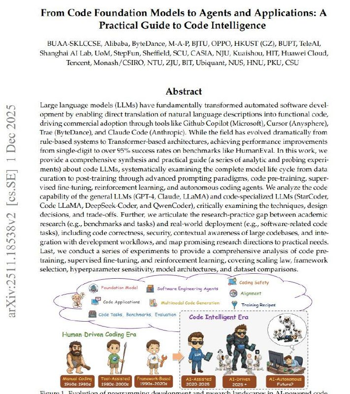

# Image Description

**File:** img_1764845298_aqadmw5rgwxgiul9_320951_9_3_01_spin_211234.jpg
**Original:** image.jpg
**Received:** 1764845298

## Extracted Text (OCR)

## 320951]9}3] эро 01 SPIN) [е2112е34 y :suoyesyddy pue sjuasy о} эрод;: чоцерипол apo wold

N59 "AS "ONH 'SON wenbian 'Liga 'iF 'OLN ОПУ ЧМО "UasuaT, 'ONO eAenpy "pp "noysteny (ON "WISW 'пою 'preueus 'ungdays 'wor 'ge ] у teysueys Twa 'Tang (7 oO) S09 'Oddo 'Old aw 'ourdaiag 'eaqraqry "FSIS WW

Se a oe

'suosteduroo jaseyep pue 'Sammpaywore japour 'Ayratsuas JayjoureredsadAy "uorsaqas WIOMALUET] (MP) SUTTEDS элита хол "SUNIIPAT JUALANIOFUIAI PUP "SUTLIN]-alny pastAradns "Зитатез} 1d роз JO SISATEUE заРАЛОДЕАОмасо т BpPIAoId с SyUMUadxD JO моя F JONPUCD aM уе 'SPaall перила OF} SUOTAAIIP срывал SUISTLOOIG GPW PUP "5 моло мА. JUAUTGO Aap цим чоцета "YU Pue 'Sasegapos ale] JO SSaUaIE ME еп "AlN 3a "учили эро? Зипрарии '(syse! IPOS роуери-отемуов "A o) JUMWAGTdap plo. M-[ear pur (Sysr] pure зулецлоринм "Sa) ysTeasal JIUBPEIE UWaaM ag des aoLJEId-—YDIeasal ay] арене aM Tay 'зно-арец pure 'suosioep LISisap 'SONDIMYIa] 8} SUILIUTEX ATEITID '(лорюуиааяру рые TJopoOy-yaagdaag ИИ] эро 'DO MEG) $ АПТ Pazuyeleds-apoo pue (WINE Ty] рае СУ Заза ayy Ара эро? ayy azAyeue зад 'spuaSe Surpoo snowouoyne pur 'Suniresy улочгеозоллоа "Sut y-auy pasts ads "SUMP -3ald роз 'SUISIPPIEd зыцанкяа PAOUPAPE YSNOIY) SUTUTPIJ-Js0d с UOTPIMD MED WOT aA ay] Боро ajaydureo ayy SuTurwexe ApeoewaysAs АГ ро jnoge (ини зах SUIQOId PUP IATPUP JO Sart

в) APS [PIIPId PUP STSaIWAS DATSUOYAICUIOD P ApIAgId aM зом ST] Uy PEAQUEUITY aly] Sy EWYyIUeg мо зауел SS999T15 лов 1000 0] иир-ерал wo SWUMUDAGIAUN AIWIPULIOPIAd SUTAaTI Ie 'SaINPATIP PISeq-IIULIDJSUPI] 04 SUIDISAS робта-зртя WOU ATT EIU EWEID PaOAd SEU Day ayy aruay "(21Idoryyuy) эро apne) pue '(aourqapig) ae. '(alaydsauy) 1osim '| pposoIsyAy) зоо у аист ayy] spooy тата чодаоре Гегузакллих» SUTALIp 'APOD [FUOWIUNY OJUL SUOHALIDSap VSENSUP] [EINJEU JO LOTE|SUPL Ap Sulgeue Ag уцзиаа о JaAID MEMOS POPWIOINE Paulsen APeyueurepung aavy (spy TT) sjepow osensury aan]

<!-- image -->

## Usage Instructions

When referencing this image in markdown:
1. Use relative path based on file location
2. Add descriptive alt text based on OCR content above
3. Add text description BELOW the image for GitHub rendering

Example:
```markdown
 <!-- TODO: Broken image path -->

**Image shows:** [Describe what the image contains based on OCR]
```
