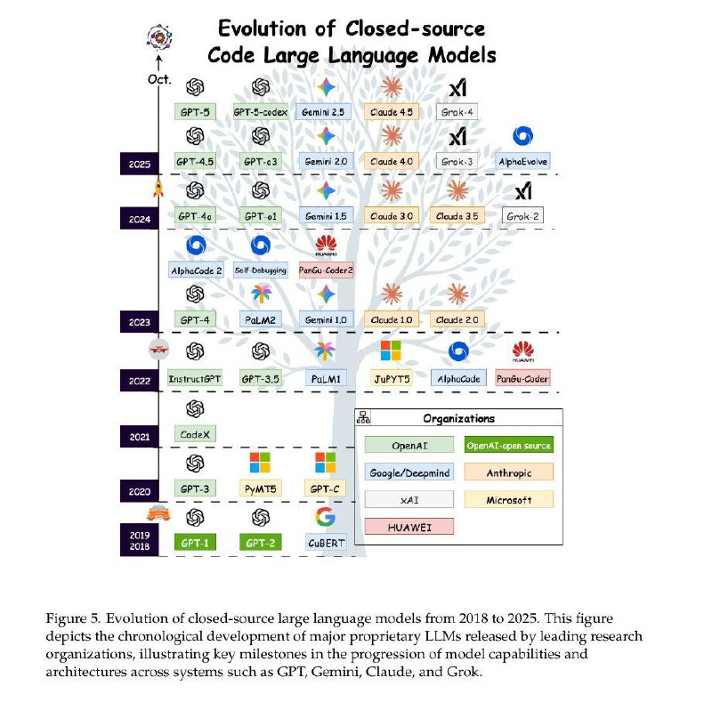

# Image Description

**File:** img_1764845298_aqadnq5rgwxgiul9_figure_5_evolution_of_closed_source_larg.jpg
**Original:** image.jpg
**Received:** 1764845298

## Extracted Text (OCR)

Figure 5. Evolution of closed-source large language models from 2018 to 2025. This Праге depicts the chronological development of major proprietary LLMs released by leading research organizations, illustrating key milestones in the progression of model capabilities and architectures across systerns such as GPT, Gemini, Claude, and Grok.

<!-- image -->

## Usage Instructions

When referencing this image in markdown:
1. Use relative path based on file location
2. Add descriptive alt text based on OCR content above
3. Add text description BELOW the image for GitHub rendering

Example:
```markdown
 <!-- TODO: Broken image path -->

**Image shows:** [Describe what the image contains based on OCR]
```
