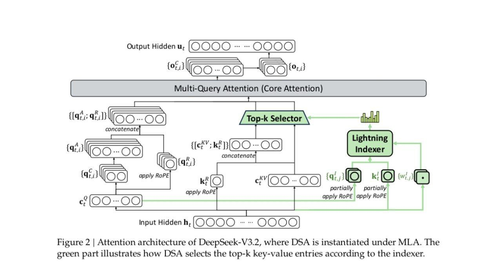

# Image Description

**File:** img_1764931113_aqadcxbrg1gfkel_figure_2_attention_architecture_of.jpg
**Original:** image.jpg
**Received:** 1764931113

## Extracted Text (OCR)

Figure 2 | Attention architecture of DeepSeek-V3.2, where DSA is instantiated under MLA. The green part illustrates how DSA selects the top-k key-value entries according to the indexer.

<!-- image -->

## Usage Instructions

When referencing this image in markdown:
1. Use relative path based on file location
2. Add descriptive alt text based on OCR content above
3. Add text description BELOW the image for GitHub rendering

Example:
```markdown
 <!-- TODO: Broken image path -->

**Image shows:** [Describe what the image contains based on OCR]
```
