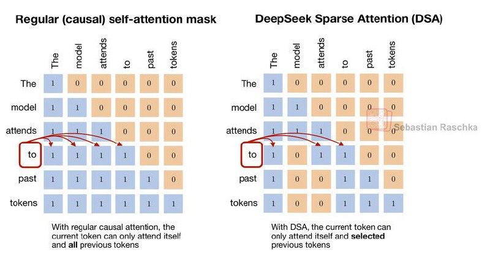

# Image Description

**File:** img_1764931113_aqadhxbrg1gfkel9_regular_causal_self_attention_mask_deeps.jpg
**Original:** image.jpg
**Received:** 1764931113

## Extracted Text (OCR)

## Regular (causal) self-attention mask DeepSeek Sparse Attention (DSA)

<!-- image -->

<!-- image -->

With regular causal attenton, the With OSA, the current token can current token can only attend itselt only attend sell and selectea and all previous tokens previous tokens

## Usage Instructions

When referencing this image in markdown:
1. Use relative path based on file location
2. Add descriptive alt text based on OCR content above
3. Add text description BELOW the image for GitHub rendering

Example:
```markdown
 <!-- TODO: Broken image path -->

**Image shows:** [Describe what the image contains based on OCR]
```
