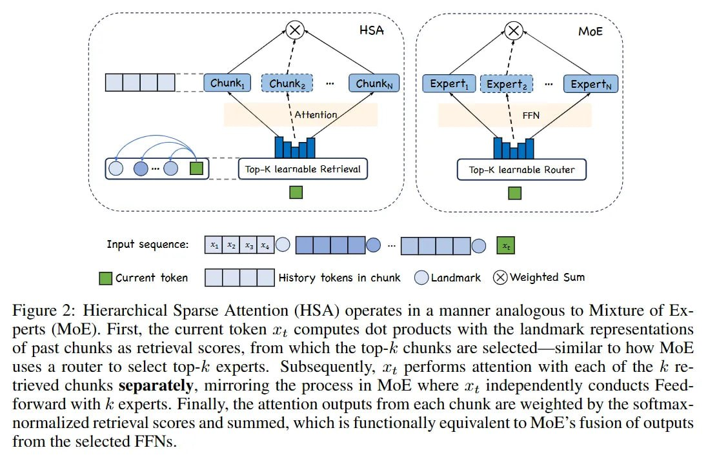

# Image Description

**File:** img_1764940436_aqadcq9rg8gkmel_figure_2_hierarchical_sparse_attention_h.jpg
**Original:** image.jpg
**Received:** 1764940436

## Extracted Text (OCR)

Figure 2: Hierarchical Sparse Attention (HSA) operates in a manner analogous to Mixture of Experts (MoE). First, the current token т; computes dot products with the landmark representations of past chunks as retrieval scores, from which the top-/ chunks are selected—similar to how Mok uses a router to select top-&amp; experts. Subsequently, 2, performs attention with each of the А retrieved chunks separately, mirroring the process in MOF where x; independently conducts Feedforward with Е experts. Finally, the attention outputs from each chunk are weighted by the softmaxnormalized retrieval scores and summed, which 1$ functionally equivalent to MoE 's fusion of outputs

<!-- image -->

## Usage Instructions

When referencing this image in markdown:
1. Use relative path based on file location
2. Add descriptive alt text based on OCR content above
3. Add text description BELOW the image for GitHub rendering

Example:
```markdown
 <!-- TODO: Broken image path -->

**Image shows:** [Describe what the image contains based on OCR]
```
