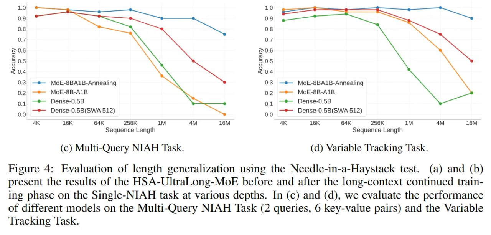

# Image Description

**File:** img_1764940436_aqaddg9rg8gkmel_figure_4_evaluation_of_length_generaliza.jpg
**Original:** image.jpg
**Received:** 1764940436

## Extracted Text (OCR)

Figure 4: Evaluation of length generalization using the Needle-in-a-Haystack test. (a) and (b) present the results of the HSA-UltraLong-MoE before and after the long-context continued training phase on the Single-NIAH task at various depths. In (c) and (d), we evaluate the performance of different models on the Multi-Query NIAH Task (2 queries, 6 key-value pairs) and the Variable Tracking Task.

<!-- image -->

## Usage Instructions

When referencing this image in markdown:
1. Use relative path based on file location
2. Add descriptive alt text based on OCR content above
3. Add text description BELOW the image for GitHub rendering

Example:
```markdown
 <!-- TODO: Broken image path -->

**Image shows:** [Describe what the image contains based on OCR]
```
