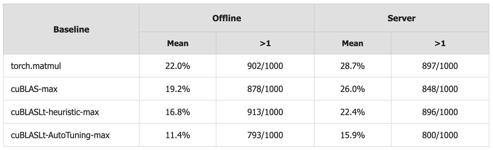

# Image Description

**File:** img_1765004604_aqadrq5rg4vkul8_server_server.jpg
**Original:** image.jpg
**Received:** 1765004604

## Extracted Text (OCR)

|                          |           | Server   | Server   |
|--------------------------|-----------|----------|----------|
| torch.matmu|             | 902/1000  |          | 897/1000 |
|                          | 8/8/1000  |          | 848/1000 |
| cuBLASLt-hneuristic-max  | 913/1000  |          | 896/1000 |
| CUBLASLt-Auto Iuning-max | /793/1000 |          | 800/1000 |

## Usage Instructions

When referencing this image in markdown:
1. Use relative path based on file location
2. Add descriptive alt text based on OCR content above
3. Add text description BELOW the image for GitHub rendering

Example:
```markdown
 <!-- TODO: Broken image path -->

**Image shows:** [Describe what the image contains based on OCR]
```
