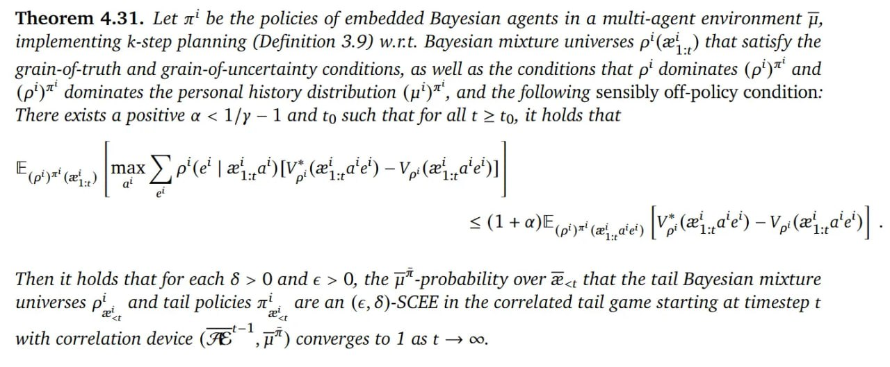

# Image Description

**File:** img_1765026629_aqadvxbrgwmdoel_theorem_4_31_let_z_be_the.jpg
**Original:** image.jpg
**Received:** 1765026629

## Extracted Text (OCR)

Theorem 4.31. Let z' be the policies of embedded Bayesian agents in a multi-agent environment |, implementing k-step planning (Definition 3.9) w.r.t. Bayesian mixture universes p'(.,) that satisfy the grain-of-truth and grain-of-uncertainty conditions, as well as the conditions that p' dominates (p')* and (p')™ dominates the personal history distribution (')" , and the following sensibly off-policy condition: There exists a positive a &lt; 1/y — Тапа to such that for all t &gt; to, it holds that

<!-- formula-not-decoded -->

Then it holds that for each 6 &gt; О апаЕ &gt; 0, the f*-probability over 2+ that the tail Bayesian mixture universes me and tail policies л' are ап (€,5)-SCEE in the correlated tail game starting at timestep t «Е with correlation device (Я ,p ) converges to 1 as t &gt; о.

## Usage Instructions

When referencing this image in markdown:
1. Use relative path based on file location
2. Add descriptive alt text based on OCR content above
3. Add text description BELOW the image for GitHub rendering

Example:
```markdown
 <!-- TODO: Broken image path -->

**Image shows:** [Describe what the image contains based on OCR]
```
