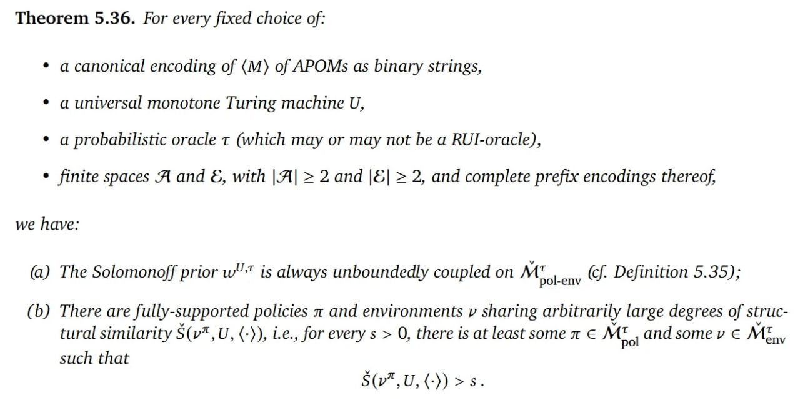

# Image Description

**File:** img_1765026629_aqadwbbrgwmdoel_theorem_5_36_for_every_fixed.jpg
**Original:** image.jpg
**Received:** 1765026629

## Extracted Text (OCR)

## Theorem 5.36. For every fixed choice of:

* a canonical encoding of (M) of APOMs as binary strings,
* a universal monotone Turing machine U,
- ‚ a probabilistic oracle т (which may or may not be a RUI-oracle),
- ¢ finite spaces A and ©, with |A| &gt; 2 and |&amp;| &gt; 2, and complete prefix encodings thereof,

we have:

- (a) The Solomonoff prior шт is always unboundedly coupled on Mt (cf. Definition 5.35);

pol-env
- (5) There are fully-supported policies л and environments v sharing arbitrarily large degrees of structural similarity S(v7,U, (-)), i.e., for every $ &gt; 0, there is at least some m € Mt ,andsomev € Mt

<!-- formula-not-decoded -->

## Usage Instructions

When referencing this image in markdown:
1. Use relative path based on file location
2. Add descriptive alt text based on OCR content above
3. Add text description BELOW the image for GitHub rendering

Example:
```markdown
 <!-- TODO: Broken image path -->

**Image shows:** [Describe what the image contains based on OCR]
```
