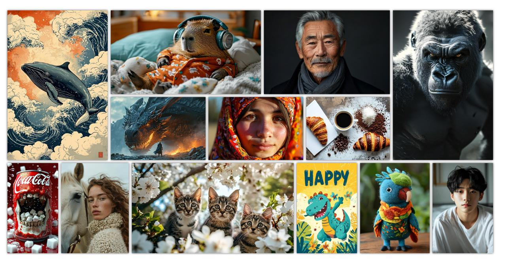

# Image Description

**File:** img_1765027380_aqadpq1rg80gmel_5a0c32a13125b7fd38a2d97a99a72d90.jpg
**Original:** image.jpg
**Received:** 1765027380

## Extracted Text (OCR)

_No text detected in image_

## Usage Instructions

When referencing this image in markdown:
1. Use relative path based on file location
2. Add descriptive alt text based on OCR content above
3. Add text description BELOW the image for GitHub rendering

Example:
```markdown
 <!-- TODO: Broken image path -->

**Image shows:** [Describe what the image contains based on OCR]
```
