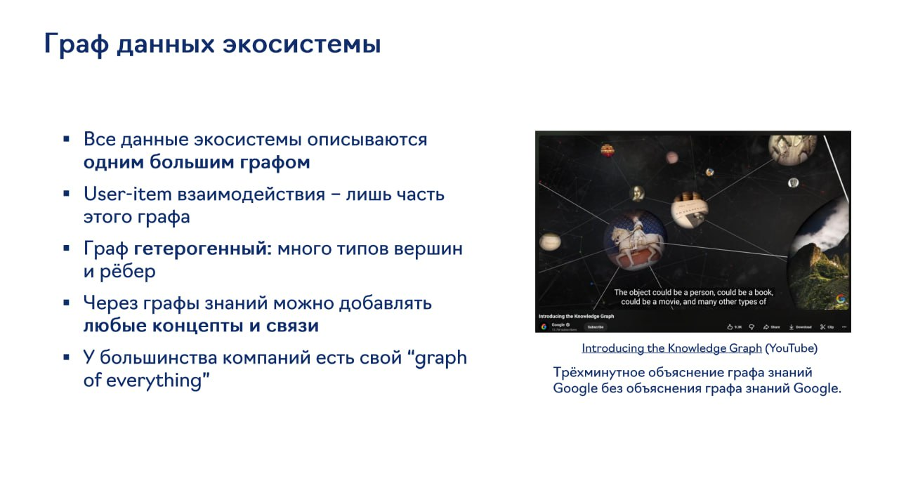

# Image Description

**File:** img_1765027576_aqadcgtrgzboul.jpg
**Original:** image.jpg
**Received:** 1765027576

## Extracted Text (OCR)

## Граф данных экосистемы

- " Bce данные экосистемы описываются одним большим графом
- " User-item взаимодействия - лишь часть этого графа
- " Граф гетерогенный: много типов вершин и ребер
- любые концепты и связи
- ee. ee "И Introducing the Knowledge Graph (YouTube Introducing the Knowledge Graph (YouTube)

— ee = = kn

" У большинства компаний есть свой "graph Трёхминутное объяснение графа знаний PREAMP ERE У РРР a err | roeyre SParirirt
Google без объяснения графа знаний Google.

of everything»

<!-- image -->

## Usage Instructions

When referencing this image in markdown:
1. Use relative path based on file location
2. Add descriptive alt text based on OCR content above
3. Add text description BELOW the image for GitHub rendering

Example:
```markdown
 <!-- TODO: Broken image path -->

**Image shows:** [Describe what the image contains based on OCR]
```
