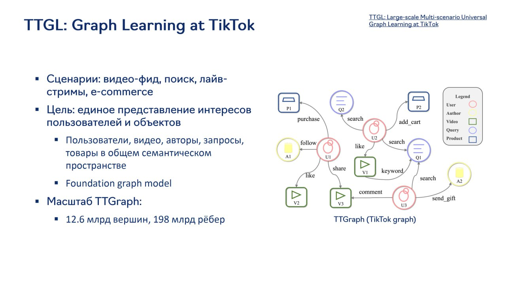

# Image Description

**File:** img_1765027576_aqaddatrgzboul_ttgl_graph_learning_at.jpg
**Original:** image.jpg
**Received:** 1765027576

## Extracted Text (OCR)

## TTGL: Graph Learning at ПКТок

- ‚ Сценарии: видео-фид, поиск, лайвстримы, €-COMmMeErce
- " Цель: единое представление интересов пользователей и объектов
- = Пользователи, видео, авторы, запросы, товары в общем семантическом просграрстгзе
- " Foundation grapn model
- *# Масштаб IT TGraph:
- " 12.6 млрд вершин, 198 млрд ребер

<!-- image -->

## Usage Instructions

When referencing this image in markdown:
1. Use relative path based on file location
2. Add descriptive alt text based on OCR content above
3. Add text description BELOW the image for GitHub rendering

Example:
```markdown
 <!-- TODO: Broken image path -->

**Image shows:** [Describe what the image contains based on OCR]
```
