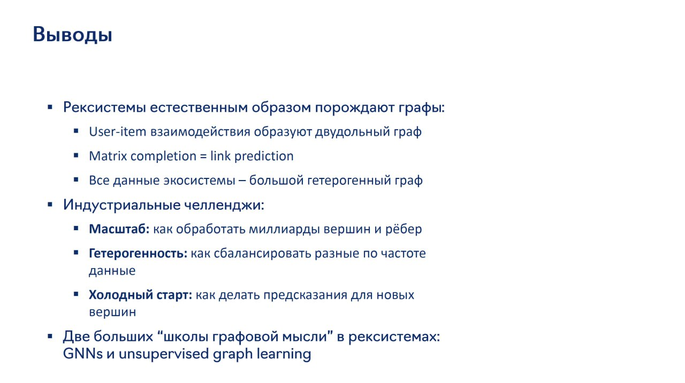

# Image Description

**File:** img_1765027576_aqaddgtrgzboul.jpg
**Original:** image.jpg
**Received:** 1765027576

## Extracted Text (OCR)

## Выводы

- = Рексистемы естественным образом порождают графы:
- = User-item взаимодеиствия образуют двудольный граф
- " Matrix completion = link prediction
- " Все данные экосистемы — большой гетерогенный граф
- " Индустриальные челленджи;
- " Масштаб: как обработать миллиарды вершин и рёбер
- " Гетерогенность: как сбалансировать разные по частоте данные
- и Холодный старт: как делать предсказания для новых вершин
- = Две больших "школы графовой мысли" в рексистемах: GNNs и unsupervised graph learning

## Usage Instructions

When referencing this image in markdown:
1. Use relative path based on file location
2. Add descriptive alt text based on OCR content above
3. Add text description BELOW the image for GitHub rendering

Example:
```markdown
 <!-- TODO: Broken image path -->

**Image shows:** [Describe what the image contains based on OCR]
```
