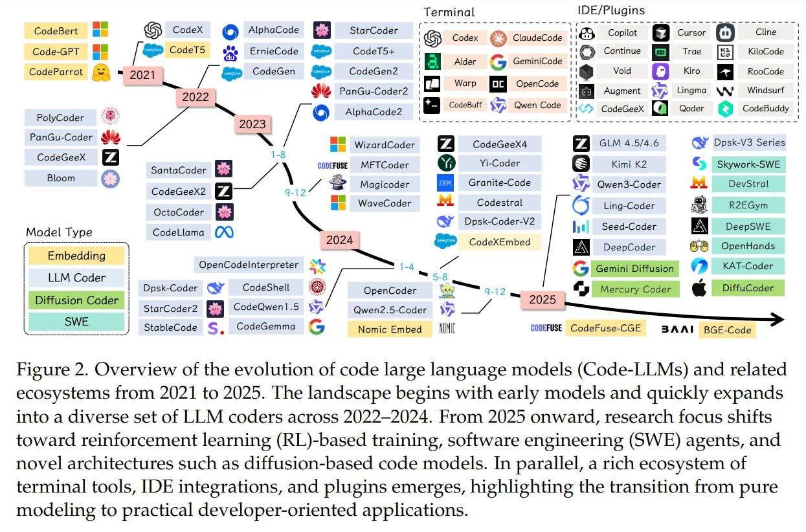

# Image Description

**File:** img_1765198206_aqad9w9rgwcvsel_figure_2_overview_of_the_evolution.jpg
**Original:** image.jpg
**Received:** 1765198206

## Extracted Text (OCR)

Figure 2. Overview of the evolution of code large language models (Code-LLMs) and related ecosystems from 2021 to 2025. The landscape begins with early models and quickly expands into a diverse set of LLM coders across 2022-2024. From 2025 onward, research focus shifts toward reinforcement learning (КГ.)-Базеа training, software engineering (SWE) agents, and novel architectures such as diffusion-based code models. In parallel, a rich ecosystem of terminal tools, IDE integrations, and plugins emerges, highlighting the transition from pure modeling to practical developer-oriented applications.

<!-- image -->

## Usage Instructions

When referencing this image in markdown:
1. Use relative path based on file location
2. Add descriptive alt text based on OCR content above
3. Add text description BELOW the image for GitHub rendering

Example:
```markdown
 <!-- TODO: Broken image path -->

**Image shows:** [Describe what the image contains based on OCR]
```
