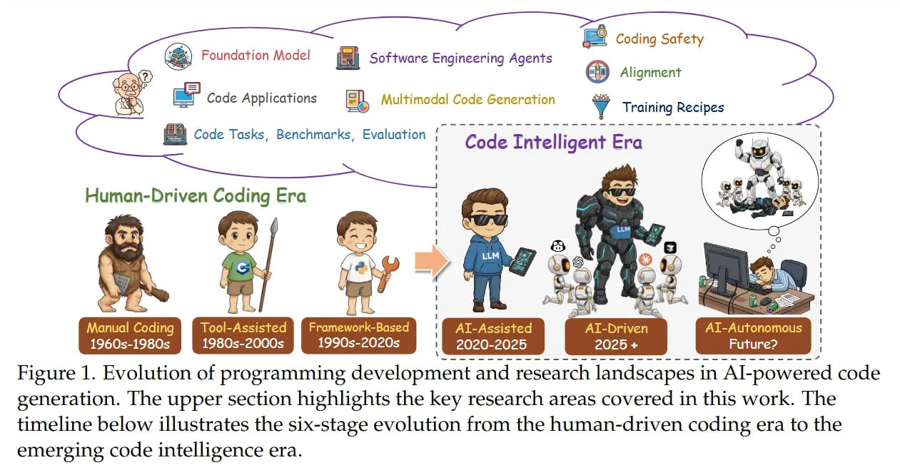

# Image Description

**File:** img_1765198206_aqada9rgwcvsel_figure_1_evolution_of_programming_develo.jpg
**Original:** image.jpg
**Received:** 1765198206

## Extracted Text (OCR)

Figure 1. Evolution of programming development and research landscapes in Al-powered code generation. [he upper section highlights the key research areas covered in this work. The timeline below illustrates the six-stage evolution from the human-driven coding era to the emerging code intelligence era.

<!-- image -->

## Usage Instructions

When referencing this image in markdown:
1. Use relative path based on file location
2. Add descriptive alt text based on OCR content above
3. Add text description BELOW the image for GitHub rendering

Example:
```markdown
 <!-- TODO: Broken image path -->

**Image shows:** [Describe what the image contains based on OCR]
```
