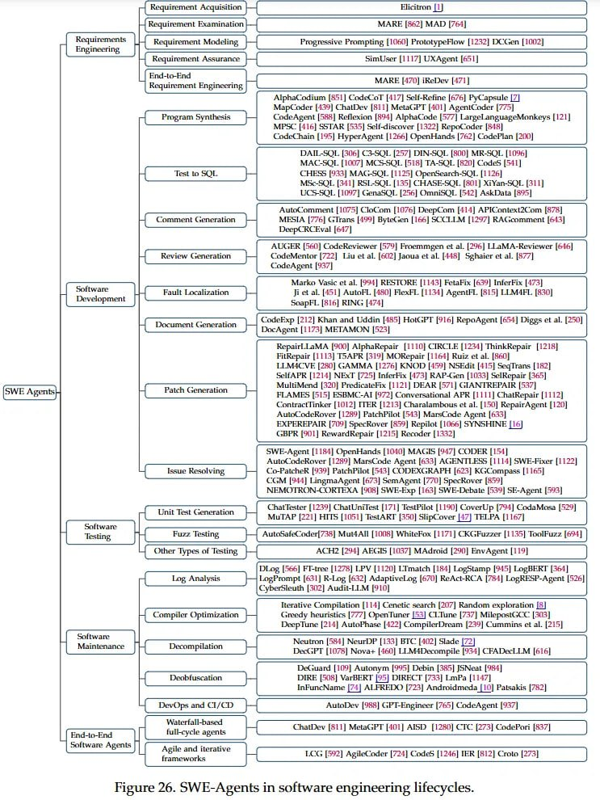

# Image Description

**File:** img_1765198206_aqadbrbrgwcvsel_wwe_avert_hl_pa_ate_testing.jpg
**Original:** image.jpg
**Received:** 1765198206

## Extracted Text (OCR)

WWE Avert

“Hl Pa aTe

Testing

“wid Ca are

Maintenance

Soltware Apents

Requirement Exaniination j—} MARE [862] MAD [764]

Progressive Prompting [1060] PrototypePlow [1252] DCCsen | 1002]

Н Requirement Assurance |

SimUser [1117] UXAgent [651]

Bnd-te-End | oer

ee a Bat” MARE [470] iReDew [471 |
Requirement Engineering pa MAE Ree |

AlphaCodium [570] CodeoT [417] Seli-Refine [a7h) PeCapsule [7]

MapCoder (439) ChatDey [811] МазсРТ Мо AgentCoder [775

Program Synthesis -— CodeAgent [ПН] Reflexion [РОЯ] AlphaCode [577] LargelanguareMonkeys [121]

MPSC [416] SSTAR [535] Self-discover [1322] RepotCoder [415]

CodeChain [195] HyperAgent [1 266) OpenHands [792] CodePlan [1.01]

DATL-SIOL, (306) (CS-S01L [257] DIN-SOL (800) МЕС, | 1056]

МАССЫ, [1007] MCSSOL [S148] TA-SOL. [820] Codes. [41]

CHESS [993] МАСОК, [1125] OpenSearch-SQL [1126]

MSc-S01L. (S41) RSL-SOL 1155) CIHASE-SOL [801] Mi¥an-SOL [311]

UCS-SOL | 109771 бага, 1256) OmniSQL |3512| Ask Data [St

Ани omimeant |117] Clotom ПИТЬ DeepCom [14] APTContext2Com [978]

DeeplRCE val [47]

Comment Generation H MESIA [774] GTrans [499] Bytetzen [lA] SCCLLM [1297] RAGcomment [e413]

AIUGER (560) CodeReviewer [579] Froemmeen et al. [296] LLaMA-Reviewer [616]

CodeMentor [722] Liu et al. [602] Jaoua et al |458] Sehaier et al. [$77

CadeAgent [937]

Marko Маме et al. (994) RESTORE |1143| FetaFix (639) InferFix [473]

Ji et al. (451) AutoFL [480] FlexFL [1131] AgentPL [8917] LUMA4PL [979]

SoapPL [8 16) RING. [474]

CodeExp |212] Khan and Uddin |157] HotGPT [916] RepoAgent [64] Diggs et al. [2%

Ки ft et a bet ay a Wat о
ЛИ АО I) nocAgent [1171] МЕТАМОМ [523]

Кора Га МА,

AlphaRepair [1110] CIRCLE [11731] ThinkRepair [12718]

FitRepair [1113] TSAPR [319) MORepair [1 164] Ruiz et al. [370]

LLMACVE (280) GAMMA [1275] KNOB [459] NSEdit [415] SeqTirans |197}

SeMnAPR [1214] NExT [725] InferPix [475] RAPSGen (1095) SelRepair [4-55]

MultitMfend [320) PredicatePix [1121] DEAR [571] GIANTREPAIR [5

FLAMES [515] ESAMC-AT [972] Conversational APR [1111] ChatRhepair [1112]

CoantractTinker [1012] ЛЕВ [1215] Charalambous et al. [150] KepairAzent [120]

AuioCodeRower | 1289) PatchPilot [1513] MarsCode Agent [695

EXPEREPAIR [709] SpecKover [859] Repilot [1066] SYNSHINE [165]

(BPR [01] RewardRepair (1215) Recoder [1332]

SWE-Agent |1 13 OpenHands [1040] MAGES [947] CODER [13]

AuioCodeRover [1289] Mars(lede Agent [434] AGENTLESS [1114] SWE-Pixer [1122

CoPatcheR (999) PatchPilot [14] CODEXGRAPH [625] KG:Compass |} 165]

COM [91-5] LingmaAgent 197] SemAgent- [770] SpecKover [B57]

NEMOTRON-CORTEAA [90] SWE-Exp [165] SWE-Debate [559] SE-Agent [543]

lint Test Generation | (allester [1239] ChatUnifest [171] TestPilot [1196] CoverUp [74] Сода Мова [529]

MuTAP [221] HITS (1051) TestART [351] SlipCower (47) TELPA [1167]

— AutoSaleCoder 738) MuttAll | 2008) WhiteFoxw | 1171] ORG Fuzzer | 1155) ToolFoos [6 |

Other Types of Testing ACH? (204) AEGIS [1037] MAdroid [290] EnvAgent [119]

СИ жк [S66] Ра [1175] LPV [1120] LT match [184] LogStamp [3/7] LogBERT [364]

LoeP romp (631) R-Log [512] AdaptiveLog [670] ReAct-RCA [764] LopRESP-Agent [524]

Cyberdleuth (302) Audit-LLM [910]

lierative Compilation [114] Genetic search [207] Random exploration [31

Greedy heuristics [777] OpenTumer [71] ClTune [757] MilepostGOe [305]

DeepTune (214) AutoPhase (422) CompilerDream (29) Curmmins et al. [215]

Neutron (54) NeurDP [133] BTC [402] Slade [72]

DeasPT [1075] Nowa+ | 460) LLM4Decompile [934] CRA Dec LLM [616]

Detiuard [109] Autonym [995] Debin [385] [SNeat [954]

DIRE [S08] VarBERT |1.) DIRECT [733] LonPa [11-7]

InFuncMame [74] ALFRED? [723] Androidnmveda [10] Patsakis [782]

DewOps and СТАС eS AuioDew 1388) GPTEngineer [765| CodeAgent [937]

full-cycle agents rl (ChatDev [811] Metat

Agile and iteralive

ЕТ 9

"РТ [НН] ASD [1280] CIC [273] CodePon [B37]

LOG [592] AgibeCoder [724] Code [1246] TER [812] (roto [273]

Figure 26. SWE-Agents in software engineering lifecycles.

Fault Localization

Decompilation

## Usage Instructions

When referencing this image in markdown:
1. Use relative path based on file location
2. Add descriptive alt text based on OCR content above
3. Add text description BELOW the image for GitHub rendering

Example:
```markdown
 <!-- TODO: Broken image path -->

**Image shows:** [Describe what the image contains based on OCR]
```
