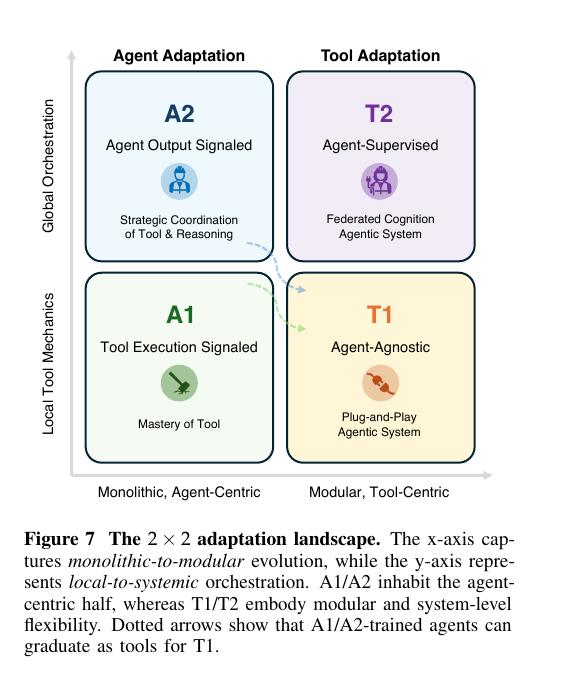

# Image Description

**File:** img_1765519261_aqadcg1rgxuc0ul9_image_figure_the.jpg
**Original:** image.jpg
**Received:** 1765519261

## Extracted Text (OCR)

<!-- image -->

Figure / The 2 x 2 adaptation landscape. [he x-axis captures monolithic-to-modular evolution, while the y-axis represents local-to-systemic orchestration. Al/AZ inhabit the agentcentric half, whereas 11/12 embody modular and system-level Hexibility. Dotted arrows show that Al/A2-trained agents can sraduate as tools for 11.

## Usage Instructions

When referencing this image in markdown:
1. Use relative path based on file location
2. Add descriptive alt text based on OCR content above
3. Add text description BELOW the image for GitHub rendering

Example:
```markdown
 <!-- TODO: Broken image path -->

**Image shows:** [Describe what the image contains based on OCR]
```
