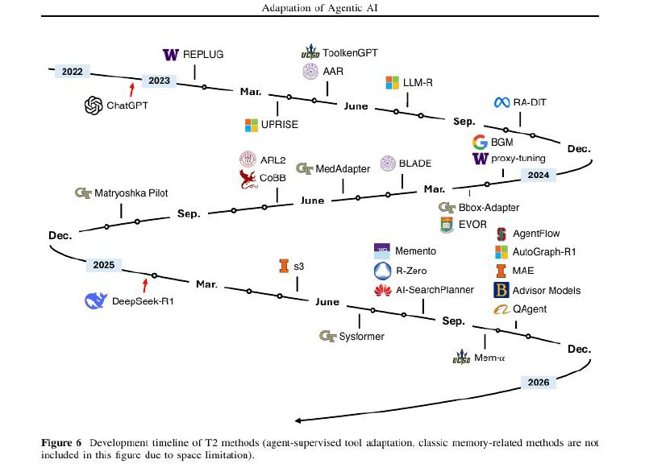

# Image Description

**File:** img_1765519261_aqadcq1rgxuc0ul9_figure_6_development_iimeline_of.jpg
**Original:** image.jpg
**Received:** 1765519261

## Extracted Text (OCR)

Figure 6 Development iimeline of Ра methods (agent-supervised tool adaplalion, Classic memory-reialed methods are not included in this figure duc to space limitation).

<!-- image -->

## Usage Instructions

When referencing this image in markdown:
1. Use relative path based on file location
2. Add descriptive alt text based on OCR content above
3. Add text description BELOW the image for GitHub rendering

Example:
```markdown
 <!-- TODO: Broken image path -->

**Image shows:** [Describe what the image contains based on OCR]
```
