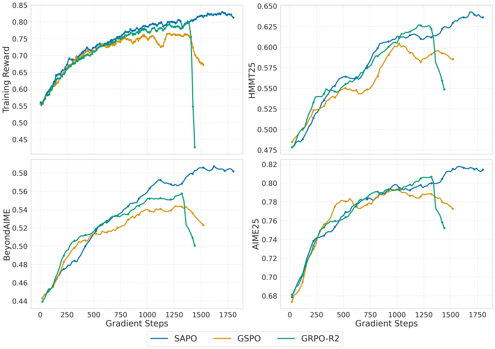

# Image Description

**File:** img_1765703618_aqadoxnrgw6e0el8_wivpuuoaeg_80_0_75_0_70.jpg
**Original:** image.jpg
**Received:** 1765703618

## Extracted Text (OCR)

WIVPUuoAeg

О 80

0.75

с 0.70

гг 0.65

&amp; 0.60

ТЕ

Cc)

().45

0.46

0) 44

250

500

750 1000 1750 1500 1/750

Gradient Steps

0.6275

и 0.575

&gt; 0.550

ОЗ}?

0.70

) 63

250

500

750 1000 1250 1500 1750

Gradient Steps

## Usage Instructions

When referencing this image in markdown:
1. Use relative path based on file location
2. Add descriptive alt text based on OCR content above
3. Add text description BELOW the image for GitHub rendering

Example:
```markdown
 <!-- TODO: Broken image path -->

**Image shows:** [Describe what the image contains based on OCR]
```
