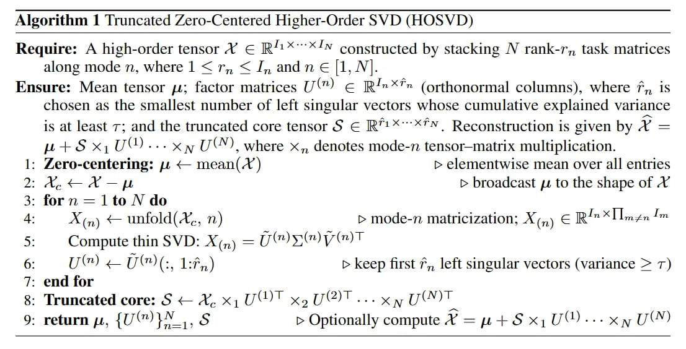

# Image Description

**File:** img_1765703759_aqadxrfrg4ffwel_algorithm_1_truncated_zero_centered_high.jpg
**Original:** image.jpg
**Received:** 1765703759

## Extracted Text (OCR)

## Algorithm 1 [Truncated Zero-Centered Higher-Order SVD (HOSVD)

Require: A high-order tensor АХ Е В ХХ constructed by stacking М rank-r,, task matrices along mode п, where 1 &lt; r,, &lt; J, and n € |1, №.

Ensure: Mean tensor pz; factor matrices U (nr) с ВХ?» (orthonormal columns), where 7,, is chosen as the smallest number of left singular vectors whose cumulative explained variance is at least т; and the truncated core tensor $ € IR™**"*""., Reconstruction is given by А = ut+tsS x,U (1)... хм UY), where x,, denotes mode-n tensor—matrix multiplication.

- 1: Zero-centering: и &lt; шеап( А) &gt; elementwise mean over all entries

2: Ap toa — &gt; broadcast д to the shape of А

- Xin) — unfold(A, п) &gt; mode-n matricization; X(,) Е В XTi myzn fm
- 5:

Compute thin SVD: Хи) = пу) у®)Т
- ии (")(: 1:7.) &gt; keep first 7,, left singular vectors (variance &gt; т)
7. end tor
- 8: Truncated core: $ &lt; №. x; UW)! xp UM)! --e xy VON!

<!-- formula-not-decoded -->

## Usage Instructions

When referencing this image in markdown:
1. Use relative path based on file location
2. Add descriptive alt text based on OCR content above
3. Add text description BELOW the image for GitHub rendering

Example:
```markdown
 <!-- TODO: Broken image path -->

**Image shows:** [Describe what the image contains based on OCR]
```
