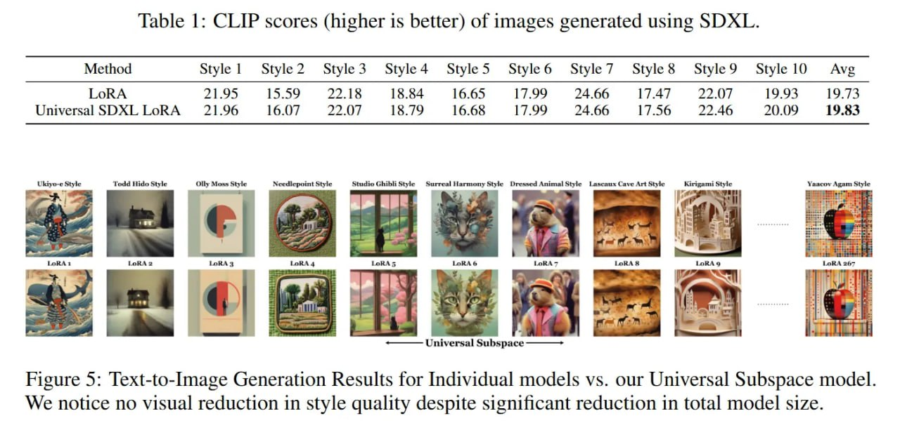

# Image Description

**File:** img_1765703760_aqadyhfrg4ffwel_table_1_clip_scores_higher_is.jpg
**Original:** image.jpg
**Received:** 1765703760

## Extracted Text (OCR)

Table 1: CLIP scores (higher is better) of images generated using SDXL.

|                                                                                     | Method Style | Style2 Styles Style4 StyleS Style6 Style / Styles StyleY9 Style 10 Ave   |
|-------------------------------------------------------------------------------------|-----------------------------------------------------------------------------------------|
| Universal SDXL LoRA 2196 16.07 22 (yf 18.79 16.68 1799 23466 17.56 2246 20.09 19.83 |                                                                                         |

Figure 5: Text-to-Image Generation Results for Individual models vs. our Universal Subspace model. We notice no visual reduction ш style quality despite significant reduction in total model size.

<!-- image -->

## Usage Instructions

When referencing this image in markdown:
1. Use relative path based on file location
2. Add descriptive alt text based on OCR content above
3. Add text description BELOW the image for GitHub rendering

Example:
```markdown
 <!-- TODO: Broken image path -->

**Image shows:** [Describe what the image contains based on OCR]
```
