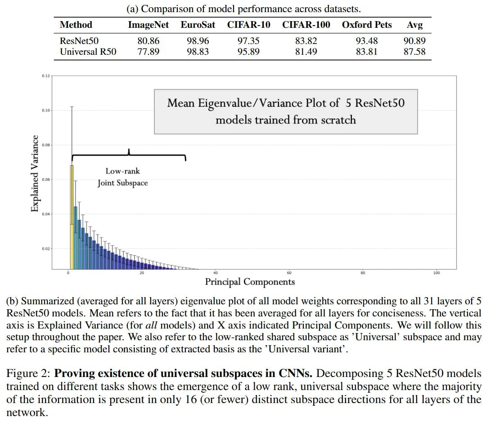

# Image Description

**File:** img_1765703760_aqadyrfrg4ffwel_a_comparison_of_model_performance.jpg
**Original:** image.jpg
**Received:** 1765703760

## Extracted Text (OCR)

- (a) Comparison of model performance across datasets.
- (&gt;) Summarized (averaged for all layers) eigenvalue plot of all model weights corresponding to all 31 layers of 5 KesNetS0 models. Mean refers to the fact that it has been averaged for all layers for conciseness. [he vertical ах1$ 15 Explained Variance (for ай models) and A axis indicated Principal Components. We will follow this setup throughout the paper. We also refer to the low-ranked shared subspace as Universal' subspace and may refer to a Specific model consisting of extracted basis as the "Universal variant .

| Method ImageNet EuroSat CIFAR-10 CIFAR-100 Oxford Pets Avg   |
|--------------------------------------------------------------|

<!-- image -->

Figure 2: Proving existence of universal subspaces in CNNs. Decomposing 5 ResNets0 models trained on different tasks shows the emergence of a low rank, universal subspace where the majority of the information 1$ present in only 16 (or fewer) distinct subspace directions for all layers of the network.

## Usage Instructions

When referencing this image in markdown:
1. Use relative path based on file location
2. Add descriptive alt text based on OCR content above
3. Add text description BELOW the image for GitHub rendering

Example:
```markdown
 <!-- TODO: Broken image path -->

**Image shows:** [Describe what the image contains based on OCR]
```
