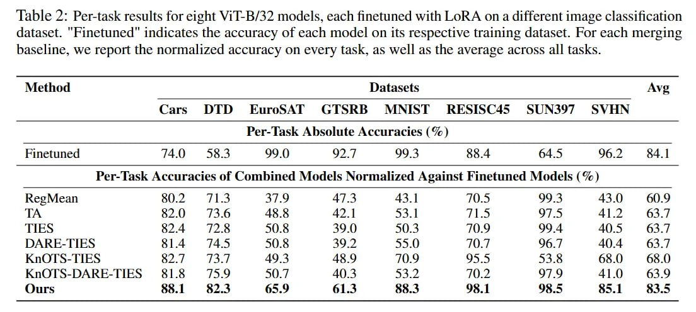

# Image Description

**File:** img_1765703760_aqadzbfrg4ffwel_table_2_per_task_results_for_eight.jpg
**Original:** image.jpg
**Received:** 1765703760

## Extracted Text (OCR)

Table 2: Per-task results for eight ViT-B/32 models, each finetuned with LoRA on a different image classification dataset. Finetuned indicates the accuracy of each model on its respective training dataset. For each merging baseline, we report the normalized accuracy on every taSK, aS Well as the average across all tasks.

| Method  Datasets  Ave                                                           |                                                                                 |                                                                                 |                                                                                 |                                                                                 |                                                                                 |                                                                                 |                                                                                 |                                                                                 |                                                                                 |
|---------------------------------------------------------------------------------|---------------------------------------------------------------------------------|---------------------------------------------------------------------------------|---------------------------------------------------------------------------------|---------------------------------------------------------------------------------|---------------------------------------------------------------------------------|---------------------------------------------------------------------------------|---------------------------------------------------------------------------------|---------------------------------------------------------------------------------|---------------------------------------------------------------------------------|
|                                                                                 | Саг DID HKuroSAlL УЕ MENIST RESISC45 SUNSY/ SVHN                                |                                                                                 |                                                                                 |                                                                                 |                                                                                 |                                                                                 |                                                                                 |                                                                                 |                                                                                 |
| Per- lask Absolute Accuracies {95 )                                             | Per- lask Absolute Accuracies {95 )                                             | Per- lask Absolute Accuracies {95 )                                             | Per- lask Absolute Accuracies {95 )                                             | Per- lask Absolute Accuracies {95 )                                             | Per- lask Absolute Accuracies {95 )                                             | Per- lask Absolute Accuracies {95 )                                             | Per- lask Absolute Accuracies {95 )                                             | Per- lask Absolute Accuracies {95 )                                             | Per- lask Absolute Accuracies {95 )                                             |
| Finetuned  FAL  553  99 ()  Oo  OO 4  So.4  64.5  962                           |                                                                                 |                                                                                 |                                                                                 |                                                                                 |                                                                                 |                                                                                 |                                                                                 |                                                                                 |                                                                                 |
| Per- lask Accuracies of Combined Models Normalized Against Finetuned Models (%) | Per- lask Accuracies of Combined Models Normalized Against Finetuned Models (%) | Per- lask Accuracies of Combined Models Normalized Against Finetuned Models (%) | Per- lask Accuracies of Combined Models Normalized Against Finetuned Models (%) | Per- lask Accuracies of Combined Models Normalized Against Finetuned Models (%) | Per- lask Accuracies of Combined Models Normalized Against Finetuned Models (%) | Per- lask Accuracies of Combined Models Normalized Against Finetuned Models (%) | Per- lask Accuracies of Combined Models Normalized Against Finetuned Models (%) | Per- lask Accuracies of Combined Models Normalized Against Finetuned Models (%) | Per- lask Accuracies of Combined Models Normalized Against Finetuned Models (%) |
| КесМеап 80.2 171.3 37.9 47.3 43.1 714.5 99.3                                    |                                                                                 |                                                                                 |                                                                                 |                                                                                 |                                                                                 |                                                                                 |                                                                                 |                                                                                 |                                                                                 |
|                                                                                 | TTS                                                                             |                                                                                 |                                                                                 |                                                                                 |                                                                                 |                                                                                 |                                                                                 |                                                                                 |                                                                                 |

## Usage Instructions

When referencing this image in markdown:
1. Use relative path based on file location
2. Add descriptive alt text based on OCR content above
3. Add text description BELOW the image for GitHub rendering

Example:
```markdown
 <!-- TODO: Broken image path -->

**Image shows:** [Describe what the image contains based on OCR]
```
