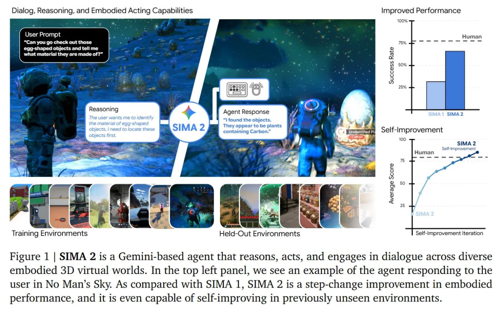

# Image Description

**File:** img_1765703869_aqad2xjrgcd0ul_image_figure_1.jpg
**Original:** image.jpg
**Received:** 1765703869

## Extracted Text (OCR)

<!-- image -->

Figure 1 | SIMA 2 is a Gemini-based agent that reasons, acts, and engages in dialogue across diverse embodied 3D virtual worlds. In the top left panel, we see an example of the agent responding to the user in No Man's Sky. As compared with SIMA 1, SIMA 2 is a step-change improvement in embodied performance, and it is even capable of self-improving in previously unseen environments.

## Usage Instructions

When referencing this image in markdown:
1. Use relative path based on file location
2. Add descriptive alt text based on OCR content above
3. Add text description BELOW the image for GitHub rendering

Example:
```markdown
 <!-- TODO: Broken image path -->

**Image shows:** [Describe what the image contains based on OCR]
```
