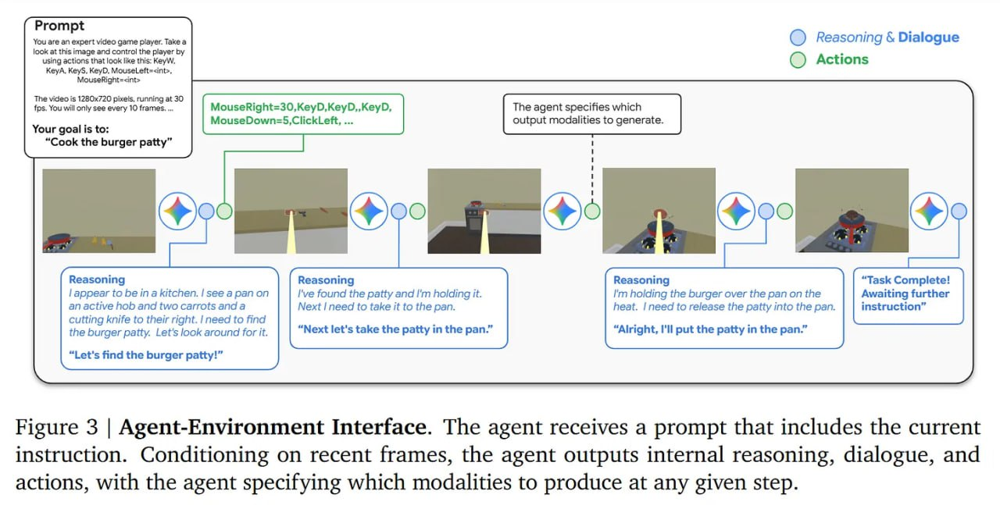

# Image Description

**File:** img_1765703869_aqad3bjrgcd0ul_image_figure_3.jpg
**Original:** image.jpg
**Received:** 1765703869

## Extracted Text (OCR)

<!-- image -->

Figure 3 | Agent-Environment Interface. The agent receives a prompt that includes the current instruction. Conditioning on recent frames, the agent outputs internal reasoning, dialogue, and actions, with the agent specifying which modalities to produce at any given step.

## Usage Instructions

When referencing this image in markdown:
1. Use relative path based on file location
2. Add descriptive alt text based on OCR content above
3. Add text description BELOW the image for GitHub rendering

Example:
```markdown
 <!-- TODO: Broken image path -->

**Image shows:** [Describe what the image contains based on OCR]
```
