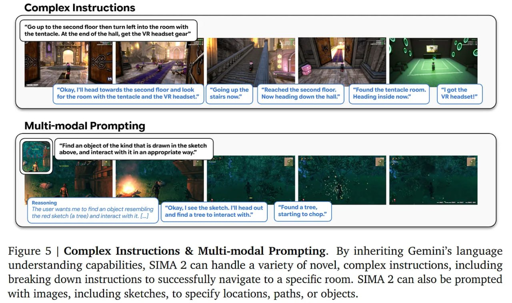

# Image Description

**File:** img_1765703869_aqad3hjrgcd0ul_complex_instructions_image.jpg
**Original:** image.jpg
**Received:** 1765703869

## Extracted Text (OCR)

## Complex Instructions

<!-- image -->

Figure 5 | Complex Instructions &amp; Multi-modal Prompting. By inheriting Gemini's language understanding capabilities, SIMA 2 can handle a variety of novel, complex instructions, including breaking down instructions to successfully navigate to a specific room. SIMA 2 can also be prompted with images, including sketches, to specify locations, paths, or objects.

## Usage Instructions

When referencing this image in markdown:
1. Use relative path based on file location
2. Add descriptive alt text based on OCR content above
3. Add text description BELOW the image for GitHub rendering

Example:
```markdown
 <!-- TODO: Broken image path -->

**Image shows:** [Describe what the image contains based on OCR]
```
