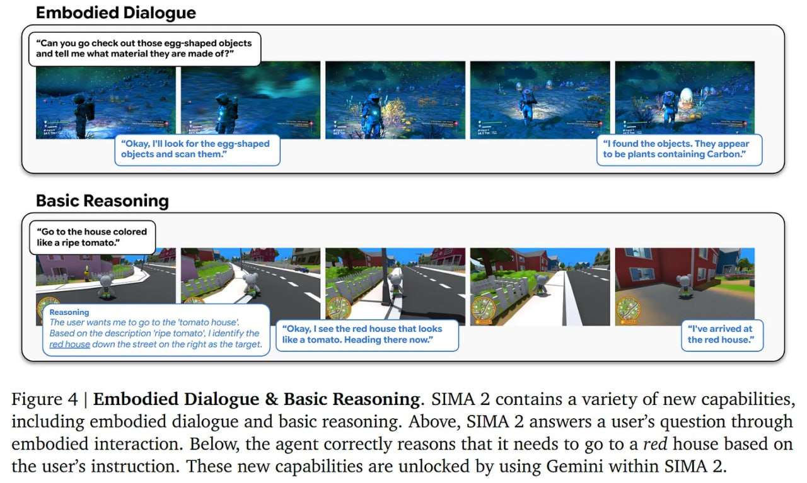

# Image Description

**File:** img_1765703869_aqad3rjrgcd0ul_embodied_dialogue_image.jpg
**Original:** image.jpg
**Received:** 1765703869

## Extracted Text (OCR)

## Embodied Dialogue

<!-- image -->

Figure 4 | Embodied Dialogue &amp; Basic Reasoning. SIMA 2 contains a variety of new capabilities, including embodied dialogue and basic reasoning. Above, SIMA 2 answers a user's question through embodied interaction. Below, the agent correctly reasons that it needs to go to a red house based on the user's instruction. These new capabilities are unlocked by using Gemini within SIMA 2.

## Usage Instructions

When referencing this image in markdown:
1. Use relative path based on file location
2. Add descriptive alt text based on OCR content above
3. Add text description BELOW the image for GitHub rendering

Example:
```markdown
 <!-- TODO: Broken image path -->

**Image shows:** [Describe what the image contains based on OCR]
```
